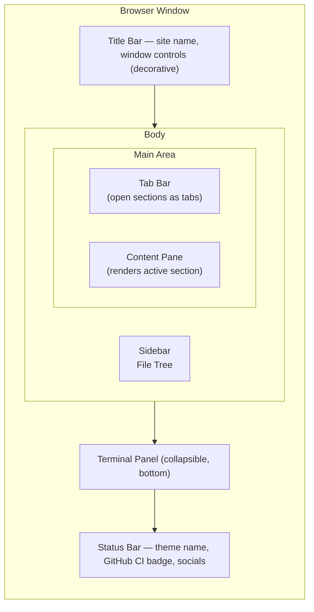
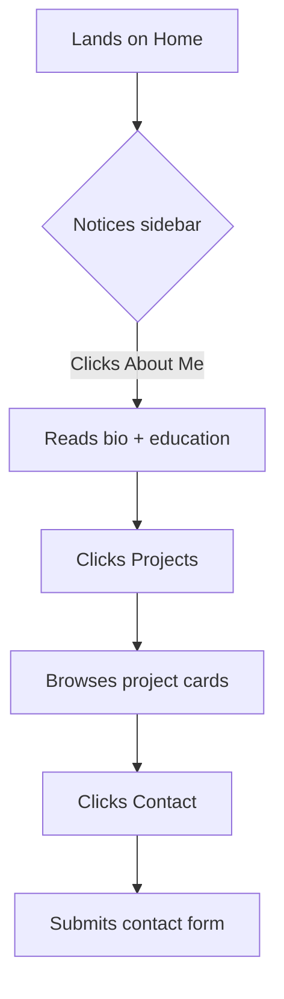
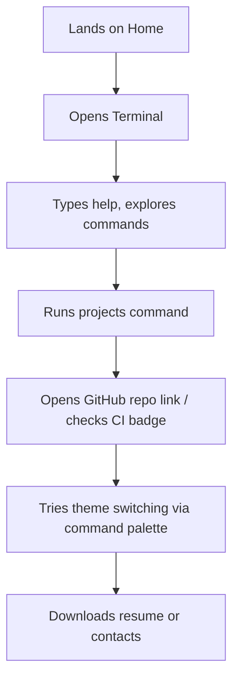
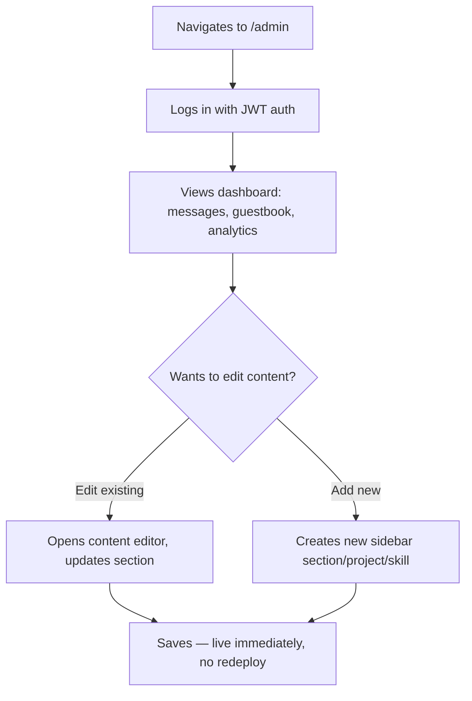

# UI/UX Spec — PortfolioOS

## 1. Design Metaphor
The site fully simulates the VS Code editor UI. Every visitor interaction is framed as a normal code-editor action: opening a file, switching a theme, using the terminal, running the command palette.

## 2. Layout (Desktop)

## 2.1 Home Content Design (Hero Style)
The VS Code chrome (sidebar, tabs, status bar) stays literal and structural everywhere — but the **Home** tab's content pane is the one place that breaks from plain markdown-in-a-file and reads as a proper landing hero, matching the personal-brand energy of the reference site while staying inside the editor metaphor (monospace touches, comment-style intro line):

- **Comment-style intro line** (small, muted, monospace): `// hello world — welcome to my portfolio`
- **Name**, large and bold: "Mohamed Ibrahim Y"
- **Tagline**, medium weight: "Building real, working software 🚀"
- **Role badge row** (pill-shaped, theme-accent colored): Backend Developer · Full-Stack · Freelancer & Educator · Final-Year CSE
- **Short intro line**: pulled from the Bio content, 1-2 sentences, not the full bio
- **CTA button row**: "Projects" (primary/filled), "About Me" (outline), "Contact" (outline) — each jumps to that sidebar section/tab, same as clicking the sidebar item
- **Stats row** below the fold, 4 stat blocks with large numbers: **4+** Projects Shipped · **13** Themes · **100%** Backend Tests Passing · **∞** Curiosity — real, verifiable numbers only, no invented metrics

Every other section (About Me, Projects, Skills, README, Files, Contact) stays as literal rendered content in the content pane per §2 — Home is intentionally the one exception, since it's the first thing every visitor sees and earns the extra design attention.

## 3. Responsiveness

### 3.1 Breakpoints
| Breakpoint | Range | Mode |
|---|---|---|
| Mobile | < 600px | Simplified shell, drawer navigation |
| Tablet | 600px – 1024px | Hybrid — collapsible sidebar, full feature set |
| Desktop | > 1024px | Full simulation as designed in §2 |

(The earlier "375px" figure was a minimum-tested width, not a real breakpoint — 600px is the actual mode switch, tested down to 360px as a hard floor.)

### 3.2 Per-Component Behavior

**Sidebar**
- Desktop: always visible, fixed width
- Tablet: collapsible via a toggle icon in the title bar, overlays content when open rather than pushing it (avoids squeezing the content pane)
- Mobile: hamburger-triggered drawer, slides in over full height, closes on selection or outside tap

**Tabs**
- Desktop/Tablet: horizontal bar, overflow scrolls with visible scroll affordance
- Mobile: collapse to a single "current section" label with a dropdown to switch — a full tab strip doesn't fit and isn't worth the horizontal scroll fight on a phone

**Terminal panel**
- Desktop/Tablet: docks to the bottom, resizable, coexists with content pane
- Mobile: opens as a full-screen overlay (not a bottom dock — not enough vertical room), with a persistent close button (not just swipe-to-dismiss, which isn't discoverable)
- **Mobile keyboard handling**: on input focus, the on-screen keyboard will cover roughly the bottom half of the viewport — the terminal's scrollback and input line must resize to stay above the keyboard (use `visualViewport` API, not just CSS `vh`, since `vh` doesn't account for the keyboard on iOS Safari)

**Pet companion**
- Desktop/Tablet: paces along the bottom as designed
- Mobile: paces along a narrower track and moves behind/below the terminal toggle button rather than overlapping it; if the terminal is open full-screen, the pet pauses (no point animating behind an overlay)

**Custom cursors**
- Cursors are a mouse-only concept — on touch devices (detected via `(hover: none)` media query, not user-agent sniffing) cursor themes silently no-op. No broken/missing-cursor states, just skip applying the custom cursor CSS.

**Command palette**
- Desktop/Tablet: centered overlay, keyboard-driven
- Mobile: full-width bottom sheet, tap-driven, larger touch targets for each theme option

### 3.3 Touch Rules
- All interactive elements (tree rows, tab close buttons, terminal toggle, command palette items) have a minimum 44×44px touch target, even where the visual element is smaller — pad the tap area, don't just scale up the icon
- No hover-dependent functionality — anything that only appears on hover (e.g. tab close "×") must also be reachable via tap/long-press on touch devices
- Respect `prefers-reduced-motion` — pet pacing/reaction animations and cursor trail effects should disable or simplify for users with this preference set, on any device

### 3.4 Fallback Philosophy
The full simulation stays on at every breakpoint — no separate "simplified mobile site." The metaphor holds up fine on a phone as long as the chrome (sidebar, tabs, terminal) adapts per §3.2; what changes is *how much UI is visible at once*, never *what's possible to do*.

## 4. Components
| Component | Behavior |
|---|---|
| Sidebar file tree | Rendered from `/api/sections`; folders expand/collapse; clicking a file opens it as a tab |
| Tab bar | Multiple sections can stay open as tabs; closable; active tab highlighted |
| Content pane | Renders markdown/JSON content for the active section; project entries render as cards with tech stack, links, highlights |
| Terminal panel | Toggle via icon or `` Ctrl+` ``-style shortcut; supports the fixed command set; logs commands to analytics |
| Command palette | `Ctrl+Shift+P`-style overlay; primary use is theme switching, secondary is quick-jump to any section |
| Status bar | Shows current theme name (click to open command palette), GitHub CI badge (links to repo), social icons |
| Admin panel (`/admin`) | Separate, simpler UI — not styled as VS Code; standard dashboard/form layout for editing content, viewing messages/analytics |

## 5. Themes
10 total, applied via a `data-theme` attribute swapping CSS custom properties:
- **Dark**: Dark+, Dracula, One Dark Pro, Monokai, Nord, Solarized Dark, Night Owl
- **Light**: Light+, Solarized Light, GitHub Light

Each theme defines: background, foreground, sidebar background, accent/highlight color, and a small syntax-color set (used for decorative "code-like" styling in content panes). Selection persists via `localStorage`.

## 6. Special Themes (Easter Eggs) — 13 Total
On top of the base 10 (§5), three additional themes are personal-passion easter eggs, discoverable via the command palette or terminal (`theme <name>`) alongside the rest:

| Theme | Visual identity | Cursor | Pet companion |
|---|---|---|---|
| **Project Hail Mary** | Warm amber/rust palette, retro-console accents | Small retro pixel-dot cursor | Rocky and Grace — small sprite, paces bottom of screen, bounces on click |
| **Interstellar** | Deep space black/navy, Gargantua-inspired accretion-disk glow as an accent gradient (not a literal image) | Small glowing dot with a faint trailing particle | A rocket sprite, paces bottom of screen, thrust-flare animation on click |
| **F1** | Racing red/carbon-fiber palette, checkered-flag accent motif | Crosshair cursor | An F1 car sprite that paces left-right and right-left along the bottom, quick boost animation on click |

Only one pet is active at a time, matching whichever theme (base or special) is currently selected — base themes simply show no pet. Pets are simple walking sprites (CSS/SVG-based, no heavy animation library needed), confined to a pacing track within the sidebar's width (not the full viewport), styled after the VS Code Pets extension's pacing behavior, with one small click-triggered reaction animation each. Cursor styles for these three themes are custom (crosshair, glowing dot, pixel-dot); base themes use the default cursor.

**IP note:** these are original visual interpretations (color palettes, abstract glow effects, simple sprites) inspired by the works' themes — not reproductions of movie stills, logos, or official artwork. Keep all pet/cursor assets hand-designed or AI-generated originals, not copied images from the films.

## 7. Terminal Command Set
| Command | Result |
|---|---|
| `help` | Lists all commands |
| `whoami` | Name + one-line tagline |
| `about` | Short bio, link to About Me |
| `education` | Degree, college, CGPA |
| `skills` | Skill category list |
| `projects` | Project names, clickable |
| `resume` | Triggers PDF download |
| `contact` | Shows email/socials or opens Contact tab |
| `socials` | GitHub/LinkedIn/etc. links |
| `theme <name>` | Switches theme live |
| `clear` | Clears terminal output |
| `sudo hire-me` | Easter egg — playful animated response |

## 8. Keyboard Shortcuts (Desktop/Tablet)
The whole point of the metaphor is that it should *feel* like an editor — real IDE muscle memory should work here, not just look like it does.

| Shortcut | Action |
|---|---|
| `Ctrl/Cmd + Shift + P` | Open command palette (theme switch, quick-jump to any section) |
| `` Ctrl/Cmd + ` `` | Toggle terminal panel |
| `Ctrl/Cmd + B` | Toggle sidebar visibility |
| `Ctrl/Cmd + P` | Quick-open — fuzzy search jump to any section (separate from command palette; classic VS Code "go to file") |
| `Ctrl/Cmd + W` | Close active tab |
| `Ctrl/Cmd + Tab` | Cycle to next open tab |
| `Ctrl/Cmd + Shift + Tab` | Cycle to previous open tab |
| `↑ / ↓` | Navigate sidebar tree items when sidebar has focus |
| `Enter` | Open focused sidebar item |
| `Esc` | Close command palette / quick-open / terminal (whichever is topmost) |
| `Ctrl/Cmd + K` then `Ctrl/Cmd + T` | Open theme picker directly (VS Code's real shortcut for this — a nice authentic touch) |

Implementation notes:
- Use a single global keydown listener with a shortcut registry (map of key combo → handler), not scattered per-component listeners — avoids conflicts and makes shortcuts easy to list/display in a "Keyboard Shortcuts" reference accessible from the command palette itself
- All shortcuts must not fire while an input/textarea (contact form, terminal input line, admin content editor) has focus, except `Esc` — otherwise typing "b" in the contact form would toggle the sidebar
- Not applicable on mobile (§3) — touch has no keyboard shortcuts; rely on the tap-driven equivalents (hamburger for sidebar, terminal toggle button, bottom-sheet command palette)

## 9. Primary User Flows

### 9.1 First-time visitor (non-technical)

### 9.2 Technical visitor

### 9.3 Admin (Ibrahim)

## 10. Accessibility Notes
- Every theme must meet at least WCAG AA contrast for body text
- Terminal and sidebar both keyboard-navigable (tab order, enter to activate)
- Non-decorative icons carry `aria-label`s
- Keyboard shortcuts (§8) must not conflict with browser/OS-native shortcuts or screen-reader shortcuts — test with a screen reader before finalizing the shortcut list
- `prefers-reduced-motion` respected for all animation (pets, cursor trails, transitions) per §3.3
