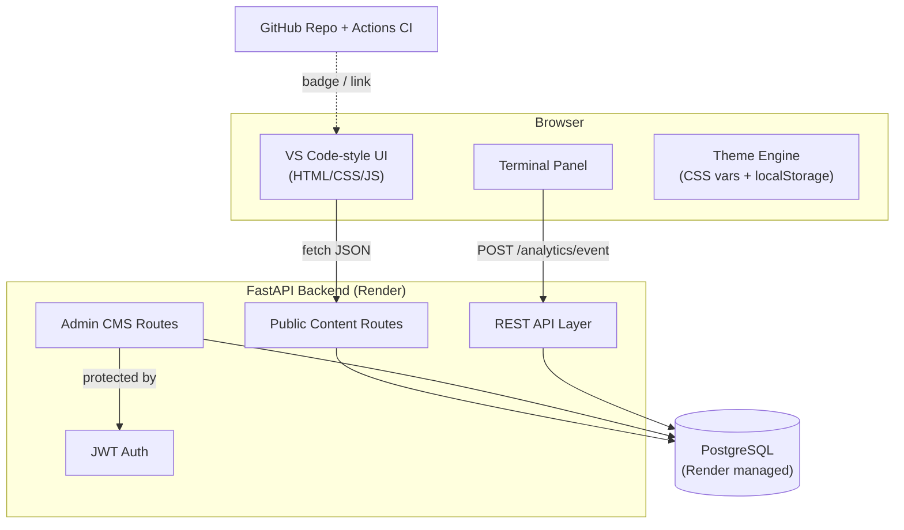

# TRD — PortfolioOS (Technical Requirements Document)

## 1. Stack
- **Frontend**: HTML, CSS, vanilla JavaScript (no framework)
- **Backend**: Python, FastAPI, SQLAlchemy (ORM), Alembic (migrations), Pydantic (schemas), python-jose or PyJWT (auth)
- **Database**: PostgreSQL
- **Hosting**: Render (web service for backend, static site or same service for frontend, managed Postgres)
- **CI/CD**: GitHub Actions (lint + test on push), badge displayed on-site
- **Version control**: Public GitHub repo, linked from the site

## 2. Architecture Overview

## 3. Non-Functional Requirements
- **Performance**: initial page interactive in under 2s on a typical connection; API responses under 300ms for content reads
- **Security**: admin routes require valid JWT; passwords hashed (bcrypt/argon2); input validated via Pydantic; rate limiting on contact/guestbook POST endpoints to prevent spam
- **Availability**: single-instance is acceptable for a portfolio (no HA requirement)
- **Responsiveness**: fully responsive across desktop (1920px, 1440px, 1366px), tablet (1024px, 768px), and mobile down to 360px/320px viewport widths; collapsible sidebar and touch-friendly controls.
- **Accessibility**: sufficient color contrast in every theme; terminal and navigation reachable via keyboard

## 4. Environments
- **Local dev**: SQLite or local Postgres via Docker Compose, `.env` for secrets
- **Production**: Render web service (backend) + Render managed PostgreSQL, environment variables set via Render dashboard (never committed)

## 5. Content Model Philosophy
No content is hardcoded into HTML/JS. Every sidebar section, project entry, and skill is a database row served through the API. The frontend is a rendering shell — this is what makes the admin CMS possible without redeploying the frontend.

## 6. Auth Model
- Single admin account (`admin_user` table), no public registration
- Login issues a short-lived JWT access token (+ optional refresh token, matching the pattern already used in the Job Tracker API project)
- Admin-only routes check the JWT on every request; no session state stored server-side beyond the user record

## 7. Logging & Analytics
- `analytics_events` table logs page views and terminal command usage with a random session id (no PII, no auth required to log)
- Aggregated view exposed only via admin-protected endpoint

## 8. Testing Approach
- Backend: Pytest for model + endpoint tests (mirrors the Job Tracker API's existing CI pattern)
- CI: GitHub Actions runs lint (ruff/flake8) + Pytest on every push; badge reflects status

## 9. Deployment Notes
- Backend serves as the API; frontend can be served as static files via FastAPI's `StaticFiles` mount (simplest single-service deploy on Render) or as a separate static site service if preferred later
- Database migrations run via Alembic on deploy (`alembic upgrade head`)
