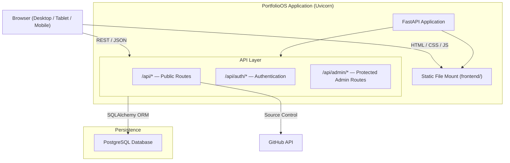
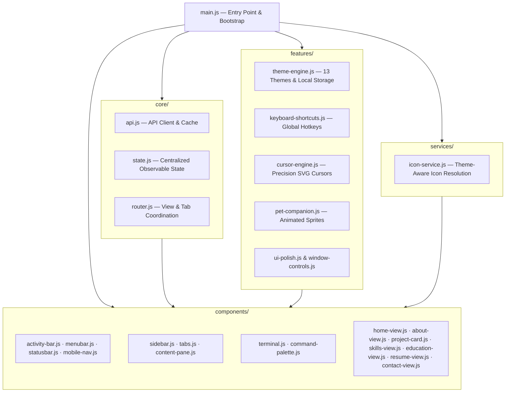
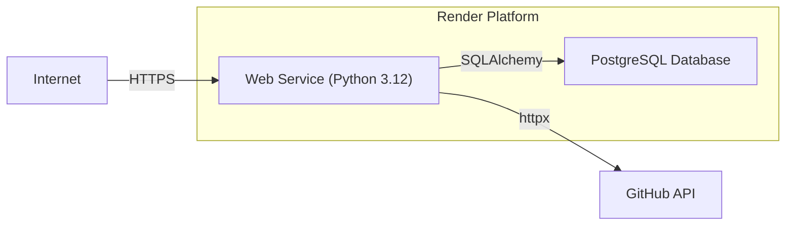

# Technical Reference Document — PortfolioOS

| Attribute | Value |
| --- | --- |
| **Document Name** | Technical Reference Document |
| **Product Name** | PortfolioOS |
| **Document Version** | 1.0 |
| **Status** | Approved |
| **Release** | PortfolioOS v1.0 |
| **Last Updated** | September 2026 |
| **Target Repository** | [github.com/Ibrahim-2005/portfolio](https://github.com/Ibrahim-2005/portfolio) |

---

## 1. System Architecture

PortfolioOS is a full-stack web application that presents a developer portfolio through a VS Code–inspired interface. The system is deliberately straightforward: a Python backend serves both a JSON API and the static frontend from a single process, backed by PostgreSQL for all persistent data.



There is no build step, no bundler, and no frontend framework. The browser loads ES modules directly from the `frontend/` directory, which FastAPI mounts as static files. API calls go to `/api/*` endpoints and return JSON. This keeps the deployment model simple — one service, one database, one process.

---

## 2. Backend Architecture

### 2.1 Application Foundation

The backend is a **FastAPI** application (`backend/app/main.py`) running on **Uvicorn**. On startup it:

1. Initializes the database connection and application components, with Alembic managing schema migrations.
2. Initializes CORS middleware with configurable origins and sets up SlowAPI rate limiting
3. Mounts public and protected admin routers under `/api` and `/api/admin`
4. Mounts the `frontend/` directory as static files (with `html=True`) as the last route, ensuring all API endpoints take priority

### 2.2 Application Structure

```
backend/
├── app/
│   ├── main.py              # Application creation, middleware, route registration, static mount
│   ├── core/                # Configuration (config.py), database engine (database.py), security (security.py), limiter (limiter.py)
│   ├── models/              # SQLAlchemy declarative ORM models (one per entity)
│   ├── schemas/             # Pydantic request/response validation schemas
│   ├── routers/             # HTTP endpoints split into public/ and admin/ subpackages
│   └── services/            # Business logic decoupled from transport and HTTP handlers
├── alembic/                 # Alembic migration environment and version scripts
├── tests/                   # Pytest test suite (19 test suites + conftest.py)
├── seed.py                  # Idempotent database content seeding
├── create_admin.py          # Administrator initialization utility
├── requirements.txt         # Pinned Python package dependencies
└── alembic.ini              # Alembic runner configuration
```

### 2.3 Database Layer

**PostgreSQL** is the only data store. The connection is managed through **SQLAlchemy** with a session-per-request pattern. **Alembic** handles schema migrations.

The database holds everything: portfolio content, admin credentials, visitor messages, analytics events, and the resume PDF binary itself. Storing the resume in the database (as a `LargeBinary` column) is a deliberate decision — it ensures the uploaded file persists across container restarts on ephemeral hosting like Render.

The data models are covered in detail in [database-schema.md](database-schema.md).

### 2.4 API Design

All API routes live under `/api/`. There are three groups:

| Group | Prefix | Auth Required | Purpose |
| --- | --- | --- | --- |
| **Public** | `/api/` | No | Portfolio content, contact submission, analytics, resume delivery, source control |
| **Auth** | `/api/auth/` | No | Admin login (returns JWT) |
| **Admin** | `/api/admin/` | Yes (Bearer JWT) | Full CRUD for all CMS-managed content |

Public endpoints are read-only except for contact message submission (`POST /api/contact`) and analytics event ingestion (`POST /api/analytics/event`), both of which are rate-limited.

Admin endpoints follow a consistent pattern: list, create, update, delete — with the intentional exception of **Messages**, which supports list and read/unread toggling but not deletion in v1.0.

### 2.5 Authentication

Admin authentication uses **JWT bearer tokens**:

- `POST /api/auth/login` accepts email/password, returns a signed JWT (HS256, 60-minute expiry)
- Passwords are hashed with **bcrypt** via `passlib`
- Tokens are signed with `SECRET_KEY` from the environment
- Every admin route uses a `get_current_admin_user` dependency that extracts and validates the bearer token

There is exactly one admin account. The credentials are set through `ADMIN_EMAIL` and `ADMIN_PASSWORD` environment variables, and the account is created automatically on first startup.

### 2.6 Rate Limiting

**SlowAPI** protects public write endpoints:

- `POST /api/contact` — 5 requests per minute per IP
- `POST /api/analytics/event` — rate-limited

Rate limit violations return `429 Too Many Requests` with a human-readable error.

### 2.7 Source Control Integration

`GET /api/source-control` calls the **GitHub API** using a personal access token (`GITHUB_TOKEN`) and repository identifier (`GITHUB_REPO`) from the environment. It returns the active branch, latest commit metadata (SHA, message, author, relative date), and repository URL. If the GitHub API is unreachable, the endpoint returns a graceful fallback rather than failing.

---

## 3. Frontend Architecture

### 3.1 Technology

The frontend is **vanilla JavaScript (ES modules)**, **HTML**, and **CSS** — no React, no Vue, no build toolchain. This is a deliberate architectural choice: the portfolio itself demonstrates frontend engineering without leaning on a framework.

### 3.2 Module Organization

The JavaScript is organized into four directories under `frontend/js/`:



- **Core (`core/`)** provides shared infrastructure: API communication (`api.js`), centralized application state (`state.js`), and router synchronization (`router.js`).
- **Components (`components/`)** manage editor chrome, shell navigation, interactive panels (terminal, command palette), and view renderers (home, about, projects, skills, education, resume, contact).
- **Features (`features/`)** handle cross-cutting behavior: theme switching (`theme-engine.js`), keyboard shortcuts (`keyboard-shortcuts.js`), special-theme cursors (`cursor-engine.js`), and companion sprites (`pet-companion.js`).
- **Services (`services/`)** provide cross-component utilities like theme-aware icon resolution (`icon-service.js`).

### 3.3 Communication Pattern

Components communicate through **custom DOM events** (`document.dispatchEvent(new CustomEvent(...))`). For example, when the theme changes, a `themeChanged` event fires and every listening component updates itself. This keeps components decoupled without needing a framework's state management.

### 3.4 CSS Architecture

Stylesheets mirror the JavaScript organization:

| Directory | Responsibility |
| --- | --- |
| `css/base/` | Reset, design tokens (CSS custom properties), typography |
| `css/layout/` | Shell chrome — title bar, activity bar, sidebar, tabs, content, status bar, mobile nav |
| `css/components/` | Reusable pieces — about, home, project cards, skills, education, contact, resume, markdown, menubar, terminal, command palette, skeleton |
| `css/themes/` | 13 individual theme files, each overriding design tokens |
| `css/features/` | Pets animation, custom cursor styling |
| `css/responsive/` | Breakpoint-specific overrides for mobile (<600px) and tablet (600px–1024px) |

Stylesheets are loaded directly by `frontend/index.html` in an ordered cascade. Theme switching works by setting `data-theme` on the `<html>` element, which dynamically activates the corresponding token overrides.

### 3.5 Theme System

PortfolioOS ships 13 themes: 7 dark, 3 light, and 3 special "easter egg" themes. The theme registry lives in `theme-engine.js` and each theme has a matching CSS file.

The three special themes go beyond color palettes:

| Theme | Cursor Treatment | Companion Sprite |
| --- | --- | --- |
| Project Hail Mary | Pixel-dot cursor | Rocky |
| Interstellar | Particle trail cursor | TARS |
| F1 | Crosshair cursor | F1 Car |

Special-theme cursors and companions are handled by `cursor-engine.js` and `pet-companion.js` respectively. On touch devices and small screens, custom cursors gracefully fall back to default browser behavior.

Theme selection persists to `localStorage` and survives page reloads.

### 3.6 Responsive Architecture

The frontend uses three breakpoints:

| Range | Tier | Model |
| --- | --- | --- |
| < 600px | Mobile | Compact touch-first shell with drawer navigation |
| 600px – 1024px | Tablet | Hybrid experience with drawer, scrollable tabs, bottom terminal |
| > 1024px | Desktop | Full VS Code chrome — title bar, menu bar, activity bar, sidebar, tabs, terminal |

On smaller screens, desktop-specific chrome (title bar, menu bar, activity bar) is suppressed and replaced with a compact navigation header, hamburger menu, and slide-out drawer. The terminal is available on tablet and desktop but not on mobile.

### 3.7 Third-Party Assets

- **PDF.js** — Bundled at `frontend/assets/vendor/pdfjs/` (`pdf.min.js`, `pdf.worker.min.js`) for mobile canvas resume rendering
- **Web Fonts** — Fira Code, Plus Jakarta Sans, JetBrains Mono, Syne (loaded via Google Fonts CDN)
- **CDN Libraries** — Marked and DOMPurify for markdown parsing and sanitization

---

## 4. Admin CMS Architecture

The admin CMS is a separate single-page application at `/admin` with its own HTML, JavaScript, and styles. It is intentionally a conventional dashboard — not another VS Code simulation.

```
frontend/admin/
├── index.html                 # Admin login and dashboard shell
├── css/                       # Admin stylesheets
│   ├── admin-layout.css       # Layout chrome, login card, mobile drawer
│   ├── admin-dashboard.css    # Cards, counters, and analytics tables
│   └── admin-editor.css       # Form inputs, lists, and action modals
└── js/                        # Modular admin controllers
    ├── admin-api.js           # Authenticated API client injecting JWT Bearer tokens
    ├── admin-auth.js          # Authentication controller and tab router
    ├── admin-dashboard.js     # Toast notifications, loader, and mobile drawer
    ├── admin-editor.js        # Shared dynamic form builders
    ├── admin-home.js          # Home page copy and role badges
    ├── admin-about.js         # Biography, focus areas, and education CRUD
    ├── admin-projects.js      # Project CRUD and tech stack tag manager
    ├── admin-skills.js        # Skills and skill domains CRUD
    ├── admin-readme.js        # README markdown editor
    ├── admin-certificates.js  # Certificates markdown editor
    ├── admin-resume.js        # Resume PDF binary replacement upload
    ├── admin-contact.js       # Contact configuration and social links
    ├── admin-settings.js      # Global public settings
    ├── admin-sidebar.js       # Navigation items, ordering, and icon uploads
    ├── admin-messages.js      # Contact message inbox and read toggles
    └── admin-analytics.js     # Chart.js analytics dashboard
```

The admin app stores the JWT in session storage after login. Every API call through `admin-api.js` automatically attaches the bearer token. If the token expires or is invalid, the user is redirected to the login screen.

Each CMS module handles its own CRUD lifecycle: fetch records → render form/list → validate → submit → show feedback.

---

## 5. Data Seeding

`seed.py` (located in `backend/`) populates the database with the portfolio owner's real content: biography, projects, skills, education, contact links, sidebar navigation, and page configurations. It runs on application startup after Alembic migrations (`python seed.py`) and is idempotent — it checks for existing records before inserting.

---

## 6. Deployment Architecture



PortfolioOS deploys as a single **Render** web service:

- **Build**: `cd backend && pip install -r requirements.txt`
- **Start**: `cd backend && alembic upgrade head && python create_admin.py && python seed.py && uvicorn app.main:app --host 0.0.0.0 --port $PORT`
- **Database**: Render-managed PostgreSQL instance (`portfolio-os-db`)
- **Environment**: `DATABASE_URL`, `SECRET_KEY`, `ADMIN_EMAIL`, `ADMIN_PASSWORD`, `ALLOWED_ORIGINS`

The deployment is defined in `render.yaml`. There is no separate frontend deployment — FastAPI serves everything from one process.

---

## 7. Security Model

| Concern | Approach |
| --- | --- |
| **Admin Authentication** | JWT bearer tokens (HS256, 60-min expiry) |
| **Password Storage** | bcrypt hashing via passlib |
| **API Protection** | All `/api/admin/*` routes require valid JWT |
| **Rate Limiting** | SlowAPI on public write endpoints |
| **Input Validation** | Pydantic schemas for all request bodies |
| **CORS** | Configurable allowed origins |
| **Secrets Management** | Environment variables, never committed |

---

## 8. Key Architectural Decisions

1. **No frontend framework.** The portfolio demonstrates frontend engineering capability directly. A framework would obscure that.

2. **Database-stored resume.** Ephemeral containers on Render lose filesystem data on restart. Storing the PDF in PostgreSQL ensures it survives redeployments.

3. **Single-process deployment.** FastAPI serves both the API and the static frontend. This keeps hosting costs low and deployment simple for a single-developer project.

4. **Client-side terminal.** The terminal is a controlled CLI that runs entirely in the browser. It never executes server-side commands. This provides the interactive developer experience without security risk.

5. **GitHub API for source control.** Rather than running `git` commands on the server, the source control feature calls the GitHub API. This works cleanly on cloud hosting where the deployed container doesn't have the full git history.

6. **13 themes with design tokens.** Every theme overrides the same set of CSS custom properties. Adding a theme means adding one CSS file and one entry in the theme registry — no component rewrites needed.
