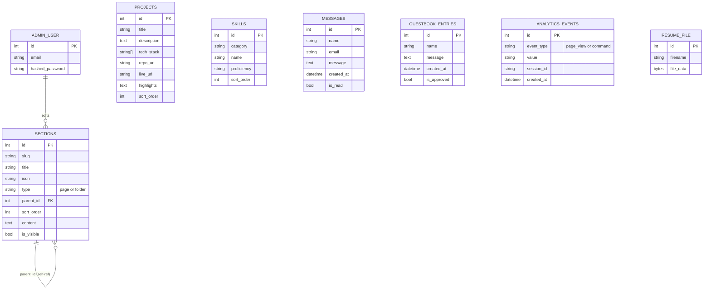

# Database Schema — PortfolioOS

## ER Diagram

## Table Notes

**`sections`** — the backbone of the sidebar file tree. Self-referencing via `parent_id` to support folders (e.g. "About Me" folder containing "Bio" and "Education" pages). `content` stores markdown or structured JSON depending on `type`. `is_visible` lets the admin hide a section without deleting it.

**`projects`** — one row per featured project. `tech_stack` can be a Postgres array or a normalized join table if you want per-tech filtering later (not needed for v1 — array is simpler).

**`skills`** — grouped by `category` (e.g. "Backend", "Frontend", "Tools"), ordered within category by `sort_order`.

**`messages`** — contact form submissions. No update from the public side after creation; admin can only mark `is_read`.

**`guestbook_entries`** — public submissions, hidden until `is_approved = true` by admin. Prevents spam/inappropriate content from going live automatically.

**`analytics_events`** — append-only log. `session_id` is a random client-generated UUID stored in `localStorage`, not tied to any personal identity — no auth or PII required to log an event.

**`admin_user`** — single row in practice (just Ibrahim). `hashed_password` via bcrypt or argon2, never stored plaintext.

**`resume_file`** — persistent binary storage for the uploaded resume PDF (`filename` and `file_data` bytea/blob), ensuring persistence across container restarts on ephemeral hosting.

## Indexing Notes
- `sections.slug` — unique index (used for direct lookups)
- `sections.parent_id` — index (tree traversal)
- `analytics_events.event_type`, `analytics_events.created_at` — index (aggregation queries)
- `messages.is_read`, `guestbook_entries.is_approved` — index (admin filtering)

## Migration Strategy
Alembic manages all schema changes. Every new section "type" or content shape should be additive (new nullable columns or a JSON field) rather than breaking existing rows — the CMS should never require a manual data migration just because the admin added a new section through the UI.
