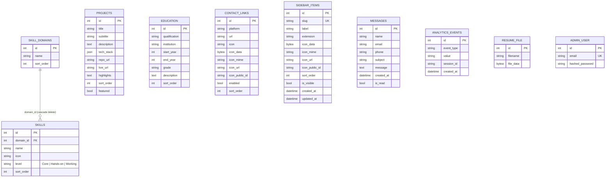

# Database Schema — PortfolioOS

| Attribute | Value |
|---|---|
| **Document Name** | Database Schema Specification |
| **Product Name** | PortfolioOS |
| **Document Version** | 1.0 |
| **Status** | Approved |
| **Release** | PortfolioOS v1.0 |
| **Last Updated** | September 2026 |
| **Target Repository** | [github.com/Ibrahim-2005/portfolio](https://github.com/Ibrahim-2005/portfolio) |

---

## 1. Overview & Data Architecture

PortfolioOS uses **PostgreSQL** as its authoritative relational database. The schema is defined and managed using **SQLAlchemy 2.0** ORM declarative models and versioned with **Alembic** migrations.

The database architecture balances two primary operational models:

1. **Relational Entities**: Structured records that support list views, filtering, relational constraints, foreign keys, and sorting (e.g. projects, skills, skill domains, education, contact links, messages, and analytics events).
2. **Singleton Configurations**: Dedicated single-row tables holding configuration and copy for specific portfolio pages (home, about, projects, skills, resume, contact, readme, certificates, and public settings). Each page owns a typed, dedicated table rather than collapsing all unstructured text into a generic key-value store, ensuring schema validation and clean administrative form binding.

Additionally, binary assets that must survive redeployments on ephemeral hosting—specifically custom uploaded resume PDFs—are stored directly in the database as binary data (`LargeBinary` / PostgreSQL `BYTEA`).

---

## 2. Entity-Relationship Diagram

---

## 3. Relational Domain Entities

### 3.1 `projects`
Stores featured software projects displayed in the `projects.sql` grid.

| Column | Type | Nullable | Default | Description |
|---|---|---|---|---|
| `id` | `Integer` | No | Auto (PK) | Primary key |
| `title` | `String(255)` | No | — | Project title |
| `subtitle` | `String(255)` | Yes | `NULL` | Concise tagline or category subtitle |
| `description` | `Text` | No | — | Architectural and functional summary |
| `tech_stack` | `JSON` / `JSONB` | No | `[]` | List of technology objects (`[{"name": "FastAPI", "icon": "..."}]`) |
| `repo_url` | `String(512)` | Yes | `NULL` | GitHub or VCS repository URL |
| `live_url` | `String(512)` | Yes | `NULL` | Public deployment or live demo URL |
| `highlights` | `Text` | Yes | `NULL` | Key engineering bullet points (newline-delimited) |
| `sort_order` | `Integer` | No | `0` | Display ordering sequence |
| `featured` | `Boolean` | No | `False` | Flag indicating high-priority display |

### 3.2 `skill_domains`
Defines grouping categories for technical skills (e.g. Backend, Databases, Frontend, Testing & Delivery, Engineering Practices).

| Column | Type | Nullable | Default | Description |
|---|---|---|---|---|
| `id` | `Integer` | No | Auto (PK) | Primary key |
| `name` | `String(100)` | No | — | Domain display name |
| `sort_order` | `Integer` | No | `0` | Display ordering sequence |

**Relationships**:
- One-to-many with `skills` (`cascade="all, delete-orphan"`). Deleting a domain deletes its attached skills.

### 3.3 `skills`
Individual technical competencies associated with a specific domain.

| Column | Type | Nullable | Default | Description |
|---|---|---|---|---|
| `id` | `Integer` | No | Auto (PK) | Primary key |
| `domain_id` | `Integer` | Yes | `NULL` | Foreign key referencing `skill_domains.id` |
| `name` | `String(100)` | No | — | Skill name (e.g. "FastAPI", "PostgreSQL") |
| `icon` | `String(255)` | Yes | `NULL` | Icon class identifier |
| `level` | `String(50)` | No | `"Working"` | Qualitative proficiency tier: `"Core"`, `"Hands-on"`, or `"Working"` |
| `sort_order` | `Integer` | No | `0` | Display ordering within its domain |

### 3.4 `education`
Academic history and qualifications.

| Column | Type | Nullable | Default | Description |
|---|---|---|---|---|
| `id` | `Integer` | No | Auto (PK) | Primary key |
| `qualification` | `String(255)` | No | — | Degree or certificate title |
| `institution` | `String(255)` | No | — | University, college, or school |
| `start_year` | `Integer` | No | — | Starting academic year |
| `end_year` | `Integer` | Yes | `NULL` | Completion year (or null if ongoing) |
| `grade` | `String(255)` | Yes | `NULL` | Academic result (e.g. "CGPA: 8.01 / 10") |
| `description` | `Text` | Yes | `NULL` | Coursework, focus areas, and honors |
| `sort_order` | `Integer` | No | `0` | Display ordering sequence |

### 3.5 `contact_links`
External social channels and contact destinations.

| Column | Type | Nullable | Default | Description |
|---|---|---|---|---|
| `id` | `Integer` | No | Auto (PK) | Primary key |
| `platform` | `String(255)` | No | — | Channel name (e.g. "Email", "LinkedIn", "GitHub") |
| `url` | `String(512)` | No | — | Target hyperlink (`mailto:` or web URL) |
| `icon` | `String(255)` | Yes | `NULL` | Standard UI icon identifier |
| `icon_data` | `LargeBinary` | Yes | `NULL` | Raw binary image storage for custom uploaded icons |
| `icon_mime` | `String` | Yes | `NULL` | MIME type of uploaded binary icon |
| `icon_url` | `String` | Yes | `NULL` | Cloudinary CDN URL for externally hosted icons |
| `icon_public_id` | `String` | Yes | `NULL` | Cloudinary asset identifier |
| `enabled` | `Boolean` | No | `True` | Visibility toggle |
| `sort_order` | `Integer` | No | `0` | Display ordering sequence |

### 3.6 `sidebar_items`
Explorer tree navigation items defining virtual files in the VS Code shell.

| Column | Type | Nullable | Default | Description |
|---|---|---|---|---|
| `id` | `Integer` | No | Auto (PK) | Primary key |
| `slug` | `String` | No | — | Unique identifier (Indexed, Unique; e.g. `home`, `about`, `projects`) |
| `label` | `String` | No | — | Display label in the file tree (e.g. "Home", "Projects") |
| `extension` | `String` | Yes | `NULL` | Virtual file extension (e.g. `.py`, `.html`, `.sql`, `.json`, `.pdf`, `.jwt`, `.md`) |
| `icon_data` | `LargeBinary` | Yes | `NULL` | Raw binary for custom uploaded icons |
| `icon_mime` | `String` | Yes | `NULL` | MIME type for custom uploaded icons |
| `icon_url` | `String` | Yes | `NULL` | Cloudinary CDN URL for hosted icons |
| `icon_public_id` | `String` | Yes | `NULL` | Cloudinary asset identifier |
| `sort_order` | `Integer` | No | `0` | Explorer tree order |
| `is_visible` | `Boolean` | No | `True` | Toggle for showing/hiding in public navigation |
| `created_at` | `DateTime(TZ)` | No | `now()` | Timestamp with time zone |
| `updated_at` | `DateTime(TZ)` | No | `now()` | Auto-updating modification timestamp |

---

## 4. Operational & Administrative Models

### 4.1 `admin_user`
Stores the single administrative account credentials for CMS access.

| Column | Type | Nullable | Default | Description |
|---|---|---|---|---|
| `id` | `Integer` | No | Auto (PK) | Primary key |
| `email` | `String(255)` | No | — | Unique administrator email address |
| `hashed_password` | `String(255)` | No | — | Bcrypt-hashed password string |

### 4.2 `messages`
Contact submissions sent from the public `contact.jwt` form.

| Column | Type | Nullable | Default | Description |
|---|---|---|---|---|
| `id` | `Integer` | No | Auto (PK) | Primary key |
| `name` | `String(255)` | No | — | Sender name |
| `email` | `String(255)` | No | — | Sender email address |
| `phone` | `String(50)` | Yes | `NULL` | Optional contact phone number |
| `subject` | `String(255)` | Yes | `NULL` | Message subject line |
| `message` | `Text` | No | — | Message body content |
| `created_at` | `DateTime(TZ)` | No | `now()` | Submission timestamp (UTC) |
| `is_read` | `Boolean` | No | `False` | Administrative read/unread state indicator (Indexed) |

### 4.3 `analytics_events`
Lightweight, privacy-first telemetry tracking page views and terminal commands.

| Column | Type | Nullable | Default | Description |
|---|---|---|---|---|
| `id` | `Integer` | No | Auto (PK) | Primary key |
| `event_type` | `String(50)` | No | — | Event classification (`"page_view"` or `"command"`, Indexed) |
| `value` | `String(512)` | Yes | `NULL` | Section slug or terminal command name |
| `session_id` | `String(36)` | Yes | `NULL` | Anonymous client UUID generated in browser storage |
| `created_at` | `DateTime(TZ)` | No | `now()` | Ingestion timestamp (Indexed) |

### 4.4 `resume_file`
Persistent binary storage for the uploaded resume PDF.

| Column | Type | Nullable | Default | Description |
|---|---|---|---|---|
| `id` | `Integer` | No | Auto (PK) | Primary key (typically singleton `id=1`) |
| `filename` | `String(255)` | No | — | Stored filename (e.g. `"Resume.pdf"`) |
| `file_data` | `LargeBinary` | No | — | Raw PDF binary stream (`BYTEA`) |

---

## 5. Singleton Configuration Models

Each singleton table maintains a single row (`id=1`) that backs the respective section view in the frontend.

| Table Name | Model Class | Key Columns | Purpose |
|---|---|---|---|
| `home_config` | `HomeConfig` | `top_text`, `name`, `tagline`, `intro`, `roles` (JSON list), `social_links` (JSON list), CTA action button labels | Landing hero copy and positioning |
| `about_config` | `AboutConfig` | `top_text`, `big_text`, `tagline`, `about_me` (markdown), `current_focus` (JSON list), `currently_learning` (JSON list), `closing_title`, `closing_text` | Biography, learning priorities, and closing callout |
| `projects_config` | `ProjectsConfig` | `top_text`, `heading`, `tagline` | Header text for the projects view |
| `skills_config` | `SkillsConfig` | `top_text`, `heading`, `tagline` | Header text for the skills matrix view |
| `resume_config` | `ResumeConfig` | `top_text`, `heading`, `tagline`, `file_path` | Resume viewer header text and static fallback path |
| `contact_config` | `ContactConfig` | `top_text`, `heading`, `tagline`, `form_footer_text` | Contact view copy and form footnote |
| `readme_config` | `ReadmeConfig` | `content` (Text/Markdown) | Formatted markdown text rendered in the README editor view |
| `certificates_config` | `CertificatesConfig` | `content` (Text/Markdown) | Markdown text for certifications and credentials |
| `public_settings` | `PublicSettings` | `tech_stack_text`, `author_text` | Global footer credits and technology labels |

---

## 6. Indexing & Optimization

Indexes are established to accelerate common queries and enforce data integrity:

1. **Unique Constraints**:
   - `admin_user.email`: Guarantees unique administrator credentials.
   - `sidebar_items.slug`: Ensures predictable route and navigation lookups.

2. **Performance Indexes**:
   - `messages.is_read` (`ix_messages_is_read`): Speeds up filtering unread contact submissions in the admin dashboard.
   - `analytics_events.event_type` (`ix_analytics_events_event_type`): Accelerates grouping and aggregation queries by event classification.
   - `analytics_events.created_at` (`ix_analytics_events_created_at`): Optimizes time-window filtering and date-based bucketing for the analytics chart.
   - Primary key indexes on all tables (`id`).

---

## 7. Migration Strategy

Schema evolutions are handled through **Alembic** (`backend/alembic/`):

- **Environment Configuration**: `backend/alembic/env.py` reads `DATABASE_URL` directly from the environment to avoid character escaping issues with connection strings.
- **Model Registration**: All models are imported in `backend/app/models/__init__.py` to ensure `Base.metadata` captures the full schema during autogeneration.
- **Deployment Lifecycle**: The release deployment sequence in `render.yaml` executes `alembic upgrade head` before starting the application, ensuring zero-downtime database updates prior to process launch.
- **Data Safety**: Schema changes follow an additive pattern to ensure backwards compatibility with existing records. Destructive drops (such as the legacy `sections` table) are performed via isolated, explicit migration scripts after data is safely transitioned.
