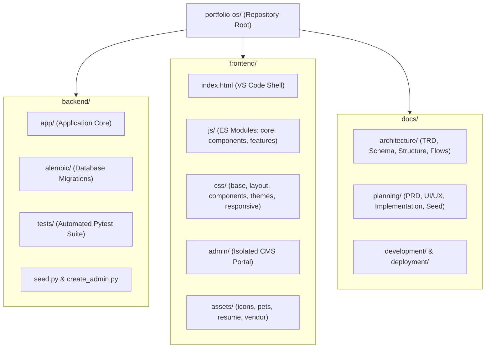

# Project Structure — PortfolioOS

| Attribute | Value |
| --- | --- |
| **Document Name** | Project Structure Specification |
| **Product Name** | PortfolioOS |
| **Document Version** | 1.0 |
| **Status** | Approved |
| **Release** | PortfolioOS v1.0 |
| **Last Updated** | September 2026 |
| **Target Repository** | [github.com/Ibrahim-2005/portfolio](https://github.com/Ibrahim-2005/portfolio) |

---

## 1. Architectural Organization

PortfolioOS is organized around a clean separation of concerns. The backend is a modular FastAPI application structured into layered responsibilities (core, models, schemas, routers, and services). The frontend is a framework-free, vanilla JavaScript and CSS implementation divided into discrete layers for foundational tokens, layout chrome, reusable components, and interactive features. The administrative CMS is isolated into its own independent application workspace.



---

## 2. High-Level Directory Overview

| Directory / File | Primary Responsibility |
| --- | --- |
| `backend/` | FastAPI REST API, SQLAlchemy models, Pydantic schemas, Alembic migrations, and test suites |
| `frontend/` | Public VS Code-inspired frontend (HTML, modular CSS, vanilla ES modules, and assets) |
| `frontend/admin/` | Dedicated, un-simulated administration dashboard for CMS content management |
| `docs/` | Comprehensive technical and product documentation across planning, architecture, and deployment |
| `render.yaml` | Infrastructure as Code specification for Render cloud web service and managed PostgreSQL |
| `runtime.txt` | Python runtime version declaration (`python-3.12.4`) |
| `.python-version` | Python environment version pin (`3.12`) |
| `README.md` | Repository landing page, project overview, architectural summary, and quickstart instructions |

---

## 3. Backend Structure (`backend/`)

The backend codebase adheres to standard separation of concerns: route handlers remain thin by delegating business logic to services, models define the database schema, and schemas enforce runtime validation.

```
backend/
├── app/
│   ├── main.py                    # FastAPI app initialization, middleware, routes, static mount
│   ├── core/                      # Application configuration and foundational utilities
│   │   ├── config.py              # Pydantic Settings reading backend/.env
│   │   ├── database.py            # SQLAlchemy engine, sessionmaker, and Base class
│   │   ├── security.py            # Password hashing (bcrypt) and JWT encode/decode
│   │   └── limiter.py             # SlowAPI rate limiter configuration
│   ├── models/                    # SQLAlchemy declarative ORM models (one file per entity)
│   │   ├── admin_user.py          # Administrator credentials table
│   │   ├── sidebar_item.py        # Navigation tree metadata items
│   │   ├── project.py             # Featured software projects
│   │   ├── skill_domain.py        # Skill categories (Backend, Frontend, etc.)
│   │   ├── skill.py               # Individual technical skills with proficiency tier
│   │   ├── education.py           # Academic qualifications and coursework
│   │   ├── contact_link.py        # Social and external contact destinations
│   │   ├── message.py             # Visitor contact submissions
│   │   ├── analytics.py           # Page view and terminal command event logs
│   │   ├── resume_file.py         # Binary storage for uploaded resume PDFs
│   │   ├── home_config.py         # Home view copy and role badge singletons
│   │   ├── about_config.py        # Biography, current focus, and learning singletons
│   │   ├── projects_config.py     # Projects view header copy singleton
│   │   ├── skills_config.py       # Skills view header copy singleton
│   │   ├── resume_config.py       # Resume view header copy singleton
│   │   ├── contact_config.py      # Contact view header copy singleton
│   │   ├── readme_config.py       # README view markdown content singleton
│   │   ├── certificates_config.py # Certificates view markdown content singleton
│   │   ├── public_settings.py     # Global footer credits and tech stack labels
│   │   └── types.py               # Custom SQLAlchemy cross-dialect decorators
│   ├── schemas/                   # Pydantic request and response schemas (mirrors models/)
│   ├── routers/                   # HTTP endpoint definitions split by privilege
│   │   ├── public/                # Unauthenticated visitor endpoints (/api/*)
│   │   │   ├── sidebar.py         # Navigation tree items
│   │   │   ├── pages.py           # Singleton page configurations
│   │   │   ├── projects.py        # Featured projects list
│   │   │   ├── skills.py          # Grouped skills matrix
│   │   │   ├── skill_domains.py   # Skill domain categories
│   │   │   ├── education.py       # Education timeline records
│   │   │   ├── contact_links.py   # Enabled social channels
│   │   │   ├── contact.py         # Contact form message submission
│   │   │   ├── resume.py          # Inline resume streaming and download
│   │   │   ├── source_control.py  # Cached GitHub API repository telemetry
│   │   │   └── analytics.py       # Non-blocking telemetry event ingestion
│   │   └── admin/                 # JWT-protected CMS management endpoints (/api/admin/*)
│   │       ├── auth.py            # Admin login endpoint (/api/auth/login)
│   │       ├── sidebar.py         # Explorer tree item management and icon uploads
│   │       ├── pages.py           # Singleton page copy updates
│   │       ├── projects.py        # Project CRUD operations
│   │       ├── skills.py          # Skill CRUD operations
│   │       ├── skill_domains.py   # Skill domain CRUD operations
│   │       ├── education.py       # Academic record CRUD operations
│   │       ├── contact_links.py   # Social link CRUD and icon uploads
│   │       ├── messages.py        # Contact submission inbox and read-state toggles
│   │       ├── resume.py          # Resume PDF replacement upload
│   │       └── analytics.py       # Aggregated traffic and command metrics
│   └── services/                  # Business logic decoupled from HTTP transport
│       ├── auth_service.py        # Admin credential verification
│       ├── page_service.py        # Dynamic singleton fetching and persistence
│       ├── skill_service.py       # Skills aggregation and ordering
│       ├── skill_domain_service.py# Domain validation and deletion guards
│       ├── education_service.py   # Academic record management
│       ├── contact_link_service.py# Link configuration handling
│       ├── analytics_service.py   # Telemetry aggregation queries
│       ├── cloudinary_service.py  # Custom icon upload and deletion integration
│       └── data_migration.py      # Data conversion and upgrade utilities
├── alembic/                       # Alembic database migration environment
│   ├── env.py                     # Migration runner and Base.metadata wiring
│   └── versions/                  # Numbered schema migration scripts
├── tests/                         # Pytest automated test suite (19 test files + conftest.py)
│   ├── conftest.py                # In-memory SQLite fixtures, client, and auth helpers
│   ├── test_admin_auth.py         # Login flow, token expiration, and rate limiting
│   ├── test_admin_crud.py         # CMS management operations across all resources
│   ├── test_analytics.py          # Background telemetry recording and schema tests
│   ├── test_cloudinary_service.py # Cloudinary upload and deletion handling
│   ├── test_contact.py            # Form validation, persistence, and rate limiting
│   ├── test_contact_links.py      # Public listing and admin CRUD for social links
│   ├── test_data_migration.py     # Skill proficiency and tech stack migration tests
│   ├── test_education.py          # Academic record CRUD and public retrieval
│   ├── test_entities_schema.py    # Pydantic entity schema validation tests
│   ├── test_models_structure.py   # SQLAlchemy model introspection tests
│   ├── test_pages.py              # Singleton page config read/write tests
│   ├── test_projects.py           # Projects ordering and public response tests
│   ├── test_resume.py             # Binary delivery and upload validation
│   ├── test_seed.py               # Database seeding and idempotency tests
│   ├── test_sidebar.py            # Sidebar items, visibility, and icon tests
│   ├── test_singletons_schema.py  # Singleton schema validation tests
│   ├── test_skill_domains.py      # Skill domains CRUD and FK cascade tests
│   └── test_skills.py             # Skills matrix and domain grouping tests
├── seed.py                        # Standalone idempotent database seeding script
├── create_admin.py                # Admin user initialization utility
├── alembic.ini                    # Alembic migration configuration
├── requirements.txt               # Pinned Python package dependencies
├── pytest.ini                     # Pytest runner configuration
├── ruff.toml                      # Ruff linter and code formatting rules
├── .env.example                   # Template environment variable definitions
└── .env                           # Local environment configuration (gitignored)
```

---

## 4. Frontend Structure (`frontend/`)

The public interface simulates a VS Code desktop editor using standard browser technologies. It requires no transpilation, bundler, or build step.

```
frontend/
├── index.html                     # Main application entry point and semantic shell
├── css/
│   ├── base/                      # Global styles, resets, and design token definitions
│   │   ├── reset.css              # Modern CSS box-sizing reset
│   │   ├── variables.css          # Design tokens (colors, surfaces, typography, dimensions)
│   │   └── typography.css         # Font stacks, heading styles, and scrollbars
│   ├── layout/                    # Structural interface regions of the editor
│   │   ├── titlebar.css           # macOS window controls, branding, and search pill
│   │   ├── activity-bar.css       # Left vertical navigation column and popovers
│   │   ├── sidebar.css            # Explorer file tree and drawer styles
│   │   ├── tabs.css               # Horizontal tab bar and tab switching visuals
│   │   ├── content-pane.css       # Main editor workspace viewport and scroll padding
│   │   ├── statusbar.css          # Bottom status strip, Git info, and theme indicators
│   │   └── mobile-nav.css         # Top navigation header for smaller viewports (≤ 1024px)
│   ├── components/                # Reusable UI component stylesheets
│   │   ├── home.css               # Hero intro, role badges, and quick CTA cards
│   │   ├── about.css              # Biography layout, focus blocks, and facts
│   │   ├── project-card.css       # Project cards, tech stack pills, and links
│   │   ├── skills.css             # Domain-grouped skills matrix and proficiency dots
│   │   ├── education.css          # Academic timeline cards
│   │   ├── contact.css            # Contact links and validated message form
│   │   ├── resume.css             # Resume toolbar, PDF iframe, and canvas containers
│   │   ├── terminal.css           # Bottom docked panel, prompt, and suggestion pills
│   │   ├── command-palette.css    # Quick Open modal dialog and result rows
│   │   ├── menubar.css            # Top desktop dropdown menus
│   │   ├── markdown.css           # GitHub-style markdown prose formatting
│   │   └── skeleton.css           # Shimmer animations for async loading states
│   ├── features/                  # Specialized feature styling
│   │   ├── cursor.css             # Theme-specific precision SVG cursors and particle trails
│   │   └── pets.css               # Animated sprite companions walking the sidebar
│   ├── responsive/                # Breakpoint-specific media query overrides
│   │   ├── tablet.css             # Tablet adaptations (600px – 1024px)
│   │   └── mobile.css             # Mobile phone adaptations (< 600px)
│   └── themes/                    # 13 switchable theme token override sheets
│       ├── dark-plus.css          # Default dark IDE theme
│       ├── light-plus.css         # Default light IDE theme
│       ├── dracula.css            # Slate and purple theme
│       ├── one-dark-pro.css       # Atom-inspired dark theme
│       ├── monokai.css            # High-contrast dark theme
│       ├── nord.css               # Arctic muted theme
│       ├── solarized-dark.css     # Low-contrast teal theme
│       ├── night-owl.css          # Deep blue coding palette
│       ├── solarized-light.css    # Amber reading palette
│       ├── github-light.css       # Clean GitHub light palette
│       ├── project-hail-mary.css  # Space amber palette (Rocky companion)
│       ├── interstellar.css       # Deep cosmic black palette (TARS companion)
│       └── f1.css                 # Racing red palette (F1 car companion)
├── js/
│   ├── main.js                    # Client bootstrap: initializes components, features, and router
│   ├── core/                      # Application-level infrastructure
│   │   ├── api.js                 # Centralized fetch client with caching and timeout handling
│   │   ├── state.js               # Centralized observable state (tabs, active section)
│   │   └── router.js              # State change listener coordinating workspace rendering
│   ├── components/                # UI component controllers
│   │   ├── sidebar.js             # Explorer tree rendering and item selection
│   │   ├── tabs.js                # Tab lifecycle (open, close, switch, drag-and-drop reorder)
│   │   ├── content-pane.js        # View dispatcher with bounded caching and scroll retention
│   │   ├── terminal.js            # Interactive CLI emulator with multi-session tabs
│   │   ├── command-palette.js     # Unified command runner and quick file search
│   │   ├── menubar.js             # Desktop top navigation dropdowns
│   │   ├── activity-bar.js        # Activity bar actions and popover controls
│   │   ├── statusbar.js           # Live status bar synchronization
│   │   ├── mobile-nav.js          # Compact header and off-canvas drawer navigation
│   │   ├── home-view.js           # Home section renderer
│   │   ├── about-view.js          # About and bio section renderer
│   │   ├── project-card.js        # Projects card grid renderer
│   │   ├── skills-view.js         # Categorized skills matrix renderer
│   │   ├── education-view.js      # Academic timeline renderer
│   │   ├── resume-view.js         # Inline PDF viewer and mobile canvas renderer
│   │   └── contact-view.js        # Contact links and interactive submission form
│   ├── features/                  # Self-contained visual and interaction features
│   │   ├── theme-engine.js        # 13-theme registry, switching, and local persistence
│   │   ├── keyboard-shortcuts.js  # Centralized keyboard shortcut dispatcher
│   │   ├── cursor-engine.js       # Dynamic SVG cursors and particle trail effects
│   │   ├── pet-companion.js       # Animated sidebar sprite logic
│   │   ├── ui-polish.js           # Cursor tracking and viewport micro-interactions
│   │   └── window-controls.js     # macOS title bar button behavior and easter eggs
│   └── services/
│       └── icon-service.js        # Centralized theme-aware file icon resolution
└── assets/                        # Static binary assets
    ├── favicon/                   # Multi-resolution browser favicons and manifest
    ├── icons/                     # File extension and section branding icons
    ├── pets/                      # Theme companion sprite sheets
    ├── resume/                    # Fallback static resume PDF binary
    └── vendor/pdfjs/              # Bundled PDF.js library for mobile canvas rendering
```

---

## 5. Admin CMS Structure (`frontend/admin/`)

The administration interface is an independent single-page application located at `frontend/admin/`. It uses a standard, high-density dashboard layout rather than attempting to reproduce the VS Code editor shell.

```
frontend/admin/
├── index.html                     # Admin application shell (login view + dashboard container)
├── css/
│   ├── admin-layout.css           # Base dashboard layout, navigation bar, and login card
│   ├── admin-dashboard.css        # Metric cards, statistics counters, and summary tables
│   └── admin-editor.css           # Form inputs, repeatable item rows, and action modals
└── js/
    ├── admin-api.js               # Authenticated API client injecting JWT Bearer tokens
    ├── admin-auth.js              # Login handler, session storage management, and auth gating
    ├── admin-dashboard.js         # Navigation tabs, toast alerts, and modal dialogs
    ├── admin-editor.js            # Shared form builders and array item managers
    ├── admin-home.js              # Home page copy and role badges manager
    ├── admin-about.js             # Biography, focus areas, and education CRUD
    ├── admin-projects.js          # Projects CRUD management with tech stack tag builder
    ├── admin-skills.js            # Skill domains and skill proficiency tier manager
    ├── admin-contact.js           # Contact page configuration and links manager
    ├── admin-sidebar.js           # Sidebar tree order, labels, and icon upload manager
    ├── admin-resume.js            # Resume PDF binary replacement upload
    ├── admin-messages.js          # Contact submission inbox with read/unread toggles
    ├── admin-readme.js            # README view markdown editor
    ├── admin-certificates.js      # Certificates view markdown editor
    ├── admin-settings.js          # Global public settings editor
    └── admin-analytics.js         # Chart.js analytics dashboard
```

---

## 6. Core Organizing Principles

1. **Strict Public vs. Admin Separation**: The public portfolio (`frontend/`) and admin CMS (`frontend/admin/`) share zero visual styling or component logic. The admin panel does not simulate an editor; it is a direct management tool.
2. **One Concern, One File**: Components, views, styles, models, and routes are split by singular responsibility. Adding or modifying an existing section does not require touching monolithic scripts or global stylesheets.
3. **Design Tokens Over Hardcoded Values**: Base stylesheets (`variables.css`) define token variable names and structural dimensions, while theme stylesheets (`themes/*.css`) provide the palette values. Theme switching occurs instantly via `data-theme` attribute reassignment.
4. **Thin Routers and Decoupled Services**: Backend route handlers validate HTTP payloads using Pydantic schemas and delegate all business logic to `app/services/`. This keeps handlers readable and ensures services can be unit-tested without launching an HTTP server.
5. **No Frontend Build Step**: By leveraging standard browser ES modules (`<script type="module">`), modern CSS custom properties, and native canvas APIs, the entire application runs directly from static source files served by FastAPI.
