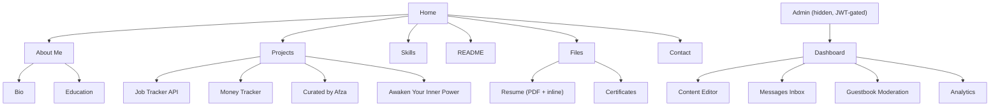
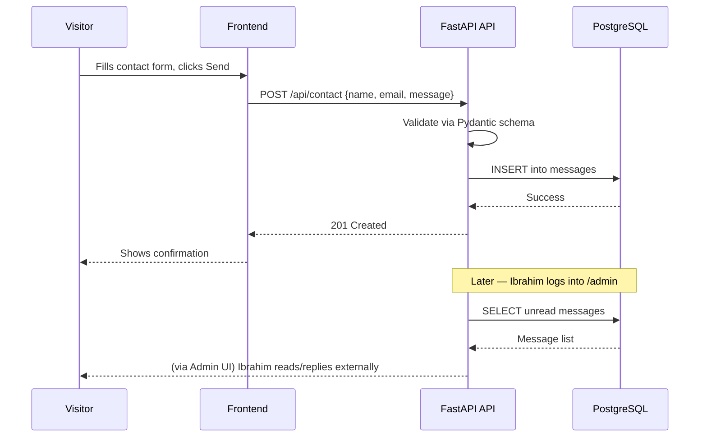
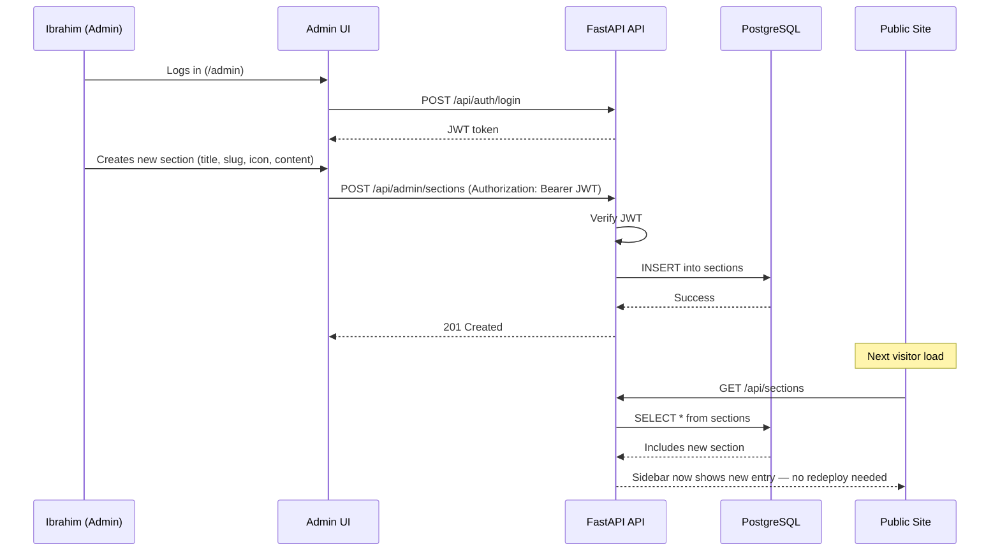
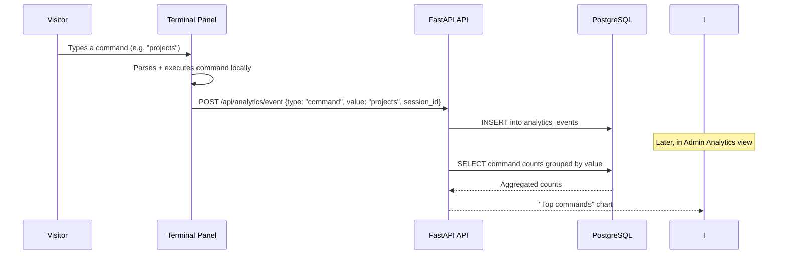

# User Flow — PortfolioOS

For per-persona navigation flows (first-time visitor, technical visitor, admin), see `UIUX-spec.md` §7. This document covers the site map and the end-to-end data flows behind key interactions.

## 1. Site Map

## 2. End-to-End Flow: Contact Form Submission

## 3. End-to-End Flow: Admin Adds a New Sidebar Section

## 4. End-to-End Flow: Terminal Command Analytics

