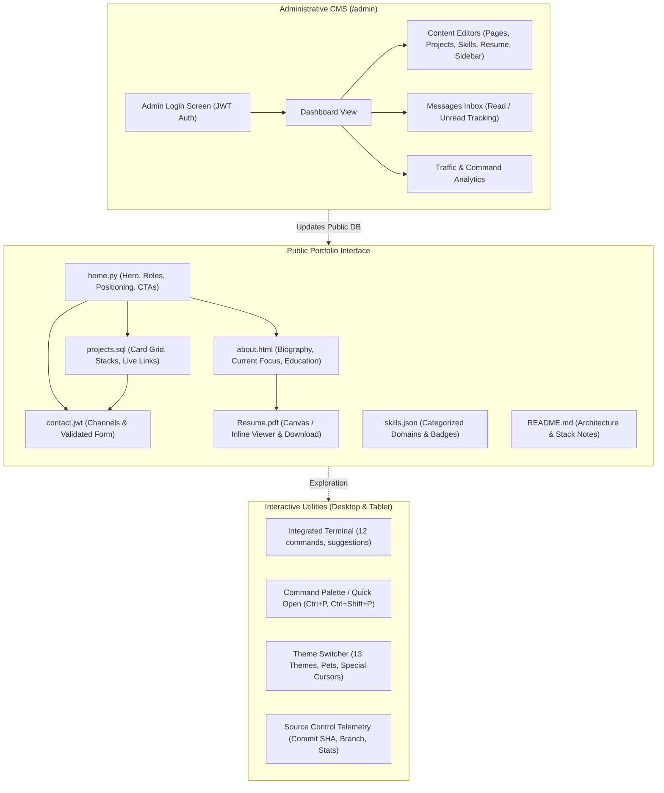
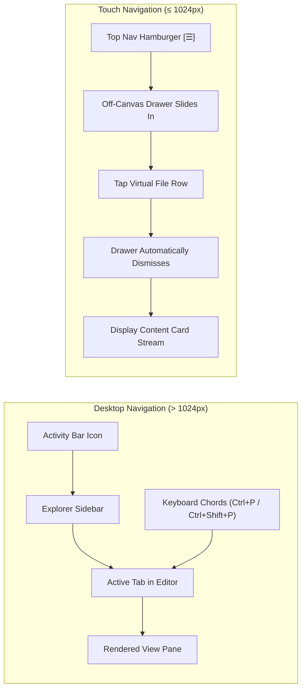
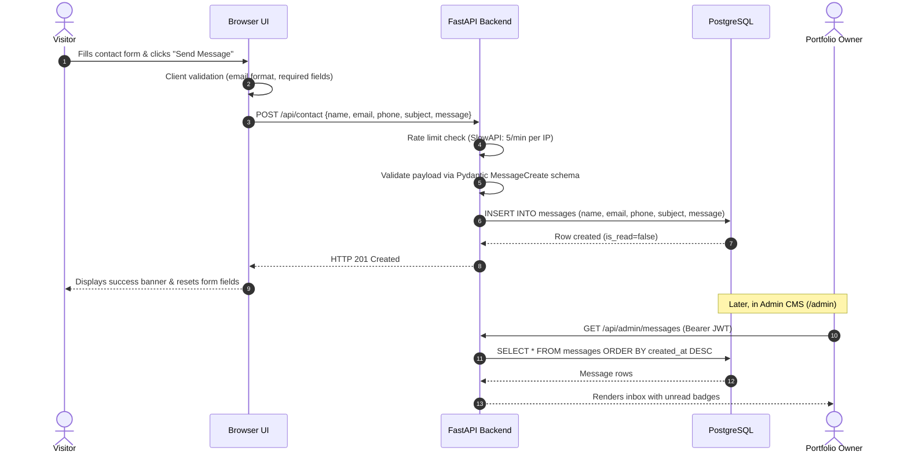
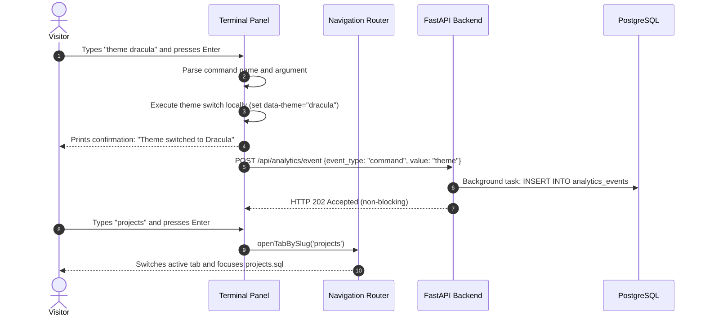
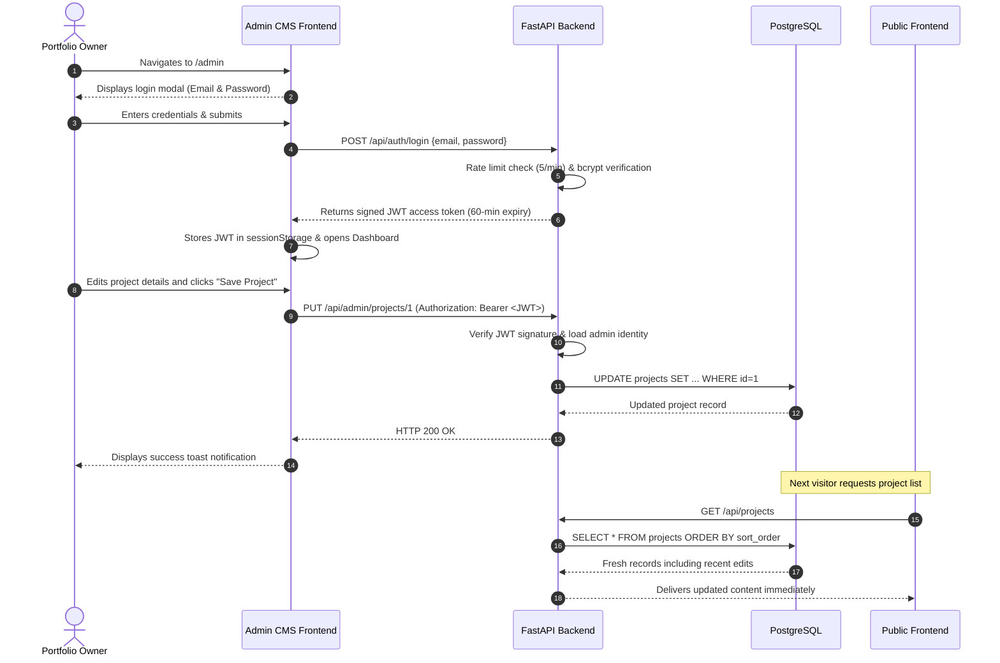

# User Flow — PortfolioOS

| Attribute | Value |
| --- | --- |
| **Document Name** | User Flow Specification |
| **Product Name** | PortfolioOS |
| **Document Version** | 1.0 |
| **Status** | Approved |
| **Release** | PortfolioOS v1.0 |
| **Last Updated** | September 2026 |
| **Target Repository** | [github.com/Ibrahim-2005/portfolio](https://github.com/Ibrahim-2005/portfolio) |

---

## 1. Overview & Navigation Map

PortfolioOS structures candidate presentation around the familiar mental model of a code editor. Visitors navigate between portfolio sections represented as virtual files within an IDE workspace. Navigation adapts progressively across desktop, tablet, and mobile viewports, while preserving content clarity and quick discovery.

---

## 2. Visitor Onboarding & Initial Landing

When a user visits the portfolio URL:

1. **Initial Page Load**: The browser requests the root URL. FastAPI returns the static `frontend/index.html` shell.
2. **Session Identification**: `api.js` checks `localStorage` for an anonymous `portfolio_sid` UUID. If none exists, a random UUID is generated to correlate client telemetry without collecting personal identity.
3. **Telemetry Ingestion**: An initial `page_view` analytics event (`event_type: "page_view", value: "home"`) is dispatched asynchronously to `POST /api/analytics/event`.
4. **Data Hydration**: The frontend fetches initial configuration via parallel REST requests:
   - `GET /api/sidebar` (visible explorer tree items)
   - `GET /api/pages/home` (home hero copy, roles, and call-to-action buttons)
   - `GET /api/source-control` (live Git telemetry)
5. **Default Workspace State**: The application restores previously opened tabs from `localStorage` (`portfolio-tabs`). If no saved session exists, `home.py` opens as the active tab. A defensive fallback guarantees that `home.py` can never be closed if it is the sole remaining tab.

---

## 3. Section Navigation Models

PortfolioOS supports two primary navigation models based on screen size:

### 3.1 Desktop Navigation (> 1024px)

On desktop viewports, the application displays full IDE chrome:

- **Title Bar**: Displays decorative window buttons, candidate branding, and current open filename.
- **Activity Bar**: Leftmost 48px icon strip providing instant triggers for Explorer, Search Palette, Source Control status popover, Terminal toggle, Direct Resume Download, and Settings popover.
- **Sidebar Explorer**: A permanent 250px vertical tree displaying virtual portfolio files (`home.py`, `about.html`, `projects.sql`, `skills.json`, `Mohamed_Ibrahim_Resume.pdf`, `contact.jwt`, `README.md`). Clicking an item opens or focuses its corresponding tab.
- **Editor Tab Strip**: Horizontal tab bar supporting multiple open tabs, active tab highlighting, tab closing (`×`), and drag-and-drop reordering.
- **Status Bar**: Bottom 22px bar indicating active Git branch, short commit SHA, active color theme pill, contact shortcut, and terminal toggle.

### 3.2 Non-Desktop & Touch Navigation (≤ 1024px)

On tablets and mobile devices:

- Application chrome (Title Bar, Menu Bar, Activity Bar) is suppressed in favor of a **Compact Navigation Header**.
- Tapping the hamburger button (`☰`) slides out the off-canvas navigation drawer with a darkened backdrop.
- Selecting any file navigates to the section and **automatically dismisses** the drawer.
- Tapping the backdrop or dismisses the drawer immediately.
- On mobile screens (`< 600px`), project cards and content sections stack into single-column layouts optimized for vertical touch scrolling.

---

## 4. Content Section Journeys

### 4.1 Home (`home.py`)

- **First Impression**: Monospace commentary (`// main.py`), headline name display, tagline, and role badges (*Backend Developer*, *Full-Stack*, *Freelancer & Educator*, *Final-Year CSE*).
- **Direct Action Triggers**:
  - `Projects` button &rarr; Switches active tab to `projects.sql`.
  - `About Me` button &rarr; Switches active tab to `about.html`.
  - `Contact` button &rarr; Switches active tab to `contact.jwt`.
- **Social Badges**: Quick links to GitHub and LinkedIn profiles.

### 4.2 Projects (`projects.sql`)

- **Card Grid**: Responsive card grid (single-column on mobile, 2-column on tablet, 3-column on desktop).
- **Technical Breakdown**: Each card highlights the project title, subtitle, architectural description, technology stack pills with icons, and key engineering bullet points.
- **External Links**: Direct action buttons link to live URLs and public GitHub repositories with outbound indicators (`↗`).

### 4.3 Skills (`skills.json`)

- **Domain Categorization**: Skills are grouped into five structured domains: *Backend*, *Databases*, *Frontend*, *Testing & Delivery*, and *Engineering Practices*.
- **Proficiency Legend**: Each skill displays a visual dot corresponding to its qualitative depth tier:
  - **Core**: Production-tested technologies used in primary architectural work.
  - **Hands-on**: Practical experience applied in projects and workflows.
  - **Working**: Familiarity and working integration knowledge.

### 4.4 Education

- **Presentation**: Academic credentials displayed within the About section and accessible via the terminal `education` command.
- **Details**: Displays institution name, degree qualification, academic period, CGPA score, and relevant coursework in systems, algorithms, and databases.

### 4.5 Resume (`Mohamed_Ibrahim_Resume.pdf`)

- **Inline Preview**:
  - **Desktop / Tablet (> 599px)**: Embedded responsive PDF viewer.
  - **Mobile (≤ 599px)**: Dynamically loads PDF.js and renders pages sequentially onto HTML5 canvas elements for native vertical touch scrolling.
- **Direct Download**: Prominent action button directly requests `/api/resume`, delivering the stored PDF binary with a `Content-Disposition: inline` header.

### 4.6 Contact (`contact.jwt`)

- **Channel Links**: Verified direct links for Email, LinkedIn, and GitHub.
- **Interactive Message Form**:
  1. Visitor fills in Full Name, Email, optional Phone, Subject, and Message.
  2. Submitting triggers client-side validation.
  3. Form button transitions to `Sending...` loading state.
  4. Backend enforces rate limiting (maximum 5 submissions per minute per IP).
  5. On success, the form clears and renders a confirmation message ("Thank you! Your message has been sent successfully.").
  6. On failure, inline alert banners display user-friendly error messages with retry capability.

### 4.7 Source Control

- **Status Bar Summary**: Real-time display of the active branch (`main`) and short commit SHA.
- **Telemetry Popover**: Clicking the Source Control icon opens a popover detailing latest commit author, relative commit timing, modified/added/deleted file counts, and a direct link to the GitHub repository.
- **Resilience**: The backend caches GitHub API responses for 60 seconds. If the external GitHub API is unreachable, the UI gracefully renders a fallback repository link.

---

## 5. Interactive & Utility Workflows

### 5.1 Theme Switching

- **Catalog**: 13 themes categorized into 7 dark themes, 3 light themes, and 3 special themes.
- **Activation Points**: Triggered via the Status Bar theme pill, Command Palette (`Ctrl+K T`), Settings popover, or terminal `theme <name>`.
- **Instant Application**: Selecting a theme reassigns the `data-theme` attribute on `<html>`, instantly cascading new CSS variables without a page reload. Selection is persisted in `localStorage`.
- **Special Themes**:
  - `Project Hail Mary`: Space amber palette, pixel-dot cursor, animated *Rocky* companion sprite in sidebar.
  - `Interstellar`: Cosmic navy palette, accretion glow, particle trail cursor, animated *TARS* companion sprite.
  - `F1`: Racing red palette, crosshair cursor, animated *F1 Car* companion sprite.
- **Touch Fallback**: On touch devices and mobile screens, custom cursor effects are automatically disabled to maintain native pointer behavior, while pet companion sprites remain visible.

### 5.2 Interactive Terminal

- **Availability**: Docked bottom panel available on **desktop and tablet** viewports (≥ 600px). Completely suppressed on mobile screens (`< 600px`).
- **Interaction**: Features bash-style prompt, multi-session tabs (`1: bash`, `2: bash`), clear button (`⊘`), maximize toggle (`⤢`), close button (`×`), command history (Up/Down arrows), and autocomplete via `Tab`.
- **Command Set**:
  - `help`: Lists available commands.
  - `whoami`: Displays candidate summary.
  - `about`, `projects`, `skills`, `education`, `contact`: Navigates to the corresponding virtual view.
  - `resume`: Triggers direct download of the resume PDF.
  - `socials`: Displays GitHub and LinkedIn URLs.
  - `theme [name]`: Switches the active theme or lists all 13 available themes.
  - `clear`: Clears terminal history for the active session.
  - `sudo hire-me`: Easter egg command triggering visual screen shake and interview confirmation.
- **Telemetry**: Executing commands dispatches anonymous usage telemetry (`POST /api/analytics/event`).

### 5.3 Command Palette & Quick Open

- **Desktop / Tablet Shortcuts**:
  - `Ctrl/Cmd + Shift + P`: Opens Command Palette in action mode (`>`).
  - `Ctrl/Cmd + P`: Opens Quick Open in file search mode.
  - `Ctrl + K` Chords: `Ctrl+K T` (Theme selector), `Ctrl+K S` (Shortcuts reference), `Ctrl+K W` (Close all tabs).
- **Fuzzy Filtering**: Filters commands, file names, and technical synonyms in real time.
- **Mobile Touch Search**: Tapping the search icon in the compact navigation header opens a touch-friendly search modal.

### 5.4 Settings

- **Desktop**: Activity Bar gear icon opens a popover pane with Theme catalog, Fullscreen toggle, and Resume download action.
- **Mobile / Tablet**: Accessed via the gear icon in the navigation drawer header. On mobile (`< 600px`), Command Palette and Toggle Terminal buttons are suppressed from quick actions.

---

## 6. Administrative CMS Workflows (`/admin`)

The `/admin` portal provides the portfolio owner with complete control over content without requiring source-code edits or redeployments.

### 6.1 Authentication & Session Handling

- Admin visits `/admin` and submits email and password.
- Successful verification returns a signed JWT access token stored in browser session storage.
- Protected admin requests include the `Authorization: Bearer <token>` header.
- Token expiration or authentication failure triggers an immediate redirect to the login screen.

### 6.2 Content Management Workflows

- **Page Copy**: Form editors update singleton configurations (`home`, `about`, `projects`, `skills`, `resume`, `contact`, `readme`, `certificates`, `settings`).
- **Sidebar Management**: Reorder items, edit labels, toggle visibility, and upload custom icons.
- **Projects CRUD**: Create and edit projects, manage JSON tech stack tags with icons, update bullet highlights, and set featured flags.
- **Skills Management**: Add and reorder skill domain categories and configure individual skill proficiency levels (*Core*, *Hands-on*, *Working*).
- **Education Records**: Manage academic degrees, institutions, GPA scores, and dates.
- **Contact Links**: Configure platform URLs and upload binary custom icons.
- **Messages Inbox**: View visitor contact submissions with read/unread toggles. Deletion is intentionally omitted in v1.0 to preserve communication records.
- **Resume Upload**: Upload replacement PDF files (up to 5MB). The binary stream is saved directly to PostgreSQL (`resume_file` table), persisting across container restarts.
- **Analytics Dashboard**: Aggregated summary charts of page views over time and top terminal command usage.
