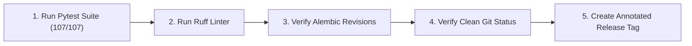
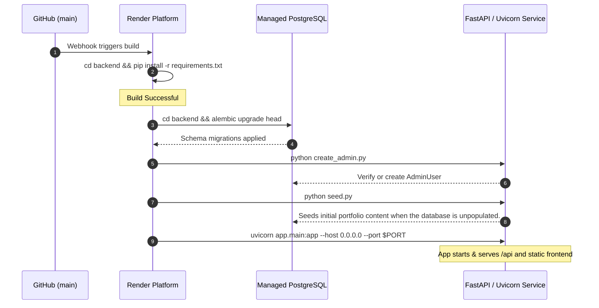

# Release Process — PortfolioOS

| Attribute | Value |
| --- | --- |
| **Document Name** | Production Release & Deployment Verification Process |
| **Product Name** | PortfolioOS |
| **Document Version** | 1.0 |
| **Status** | Approved |
| **Release** | PortfolioOS v1.0 |
| **Last Updated** | September 2026 |
| **Target Repository** | [github.com/Ibrahim-2005/portfolio](https://github.com/Ibrahim-2005/portfolio) |

---

## 1. Overview

This document defines the release process for PortfolioOS. It details the pre-release quality checks, version tagging, automated deployment execution on Render, post-deployment smoke verification, and emergency rollback procedures.

PortfolioOS deploys as a unified single-service web application with an attached PostgreSQL database. Every release follows a structured sequence to apply database migrations before the application starts and verify the deployment afterward.

---

## 2. Pre-Release Verification Checklist

Before tagging and deploying a release, complete the following verification steps locally on the `main` branch:



### 2.1 Automated Test Verification

Ensure all 107 test cases pass without errors:

```bash
cd backend
pytest
```

*Expected Result*: `107 passed`

### 2.2 Code Quality & Formatting Check

Verify that code formatting adheres to project standards:

```bash
ruff check .
```

*Expected Result*: `All checks passed!`

### 2.3 Migration Check

Confirm that all Alembic migration scripts match the current SQLAlchemy model definitions:

```bash
alembic check
```

### 2.4 Documentation & Version Alignment

Confirm that document versioning and metadata across `docs/` reflect the target release version (`v1.0.0`):

- `docs/planning/PRD.md`
- `docs/planning/UIUX-spec.md`
- `docs/architecture/TRD.md`
- `docs/architecture/database-schema.md`
- `README.md`

---

## 3. Version Tagging & Git Release

1. Verify that your local `main` branch is clean and fully synchronized with GitHub:

   ```bash
   git fetch origin
   git status
   git log HEAD..origin/main --oneline
   git log origin/main..HEAD --oneline
   ```

2. Create an annotated semantic version tag:

   ```bash
   git tag -a v1.0.0 -m "PortfolioOS v1.0 — Initial Production Release"
   ```

3. Push the tag to GitHub:

   ```bash
   git push origin v1.0.0
   ```

---

## 4. Render Deployment Execution

PortfolioOS utilizes Render's Infrastructure as Code defined in `render.yaml`. Pushing to the `main` branch or triggering a manual deploy executes the deployment lifecycle:



### 4.1 Build Stage

```bash
cd backend && pip install -r requirements.txt
```

Installs the project's Python dependencies from requirements.txt.

### 4.2 Start Stage

```bash
cd backend && alembic upgrade head && python create_admin.py && python seed.py && uvicorn app.main:app --host 0.0.0.0 --port $PORT
```

1. **`alembic upgrade head`**: Applies all pending database migrations before the web process accepts traffic.
2. **`python create_admin.py`**: Ensures the administrator account is provisioned from `ADMIN_EMAIL` and `ADMIN_PASSWORD`.
3. **`python seed.py`**: Seeds initial portfolio content when the database is unpopulated.
4. **`uvicorn app.main:app`**: Starts the ASGI production web server on the assigned `$PORT`.

---

## 5. Post-Deployment Verification (Smoke Testing)

Immediately following deployment, perform the following verification checks against the live production URL:

| Verification Step | Command / Action | Expected Result |
| --- | --- | --- |
| **1. Liveness Probe** | `curl -I https://<app-domain>/health` | HTTP `200 OK` with JSON `{"status": "ok"}` |
| **2. Public Shell** | Open `https://<app-domain>/` in browser | VS Code shell renders; default tab `home.py` opens cleanly |
| **3. Navigation API** | `curl https://<app-domain>/api/sidebar` | HTTP `200 OK` with 7 enabled navigation items |
| **4. Content API** | `curl https://<app-domain>/api/projects` | HTTP `200 OK` returning array of 4 projects |
| **5. Resume Delivery** | `curl -I https://<app-domain>/api/resume` | HTTP `200 OK` with `Content-Type: application/pdf` |
| **6. Source Control Telemetry** | `curl https://<app-domain>/api/source-control` | HTTP `200 OK` returning branch and latest commit info |
| **7. Admin Authentication** | Open `https://<app-domain>/admin/` and log in | Login succeeds; dashboard displays content tabs |
| **8. Theme Engine** | Cycle themes via Status Bar button | CSS variables re-cascade instantly without reload |
| **9. Mobile Navigation** | Open via responsive emulator (< 600px) | Drawer navigation functions cleanly; terminal is suppressed |

---

## 6. Rollback & Recovery Procedures

If a critical issue is discovered post-deployment:

### 6.1 Instant Application Rollback

Render supports instant deployment rollbacks:

1. Log in to the Render Dashboard.
2. Select the `portfolio-os-api` web service.
3. Navigate to **Events / Deploys**.
4. Locate the previously successful deployment and click **Rollback to this deploy**.
Render will immediately restart the container with the previous release artifact.

### 6.2 Database Rollback

If the failed release introduced a database migration that must be reverted:

1. Access the Render shell or connect via psql:

   ```bash
   cd backend
   alembic downgrade -1
   ```

   Database rollback should only be performed after confirming that the migration is safely reversible and that no production data would be lost or invalidated. Application rollback and database rollback are separate operations and must be assessed independently.

2. Confirm the database schema returned to the previous revision before redeploying.
