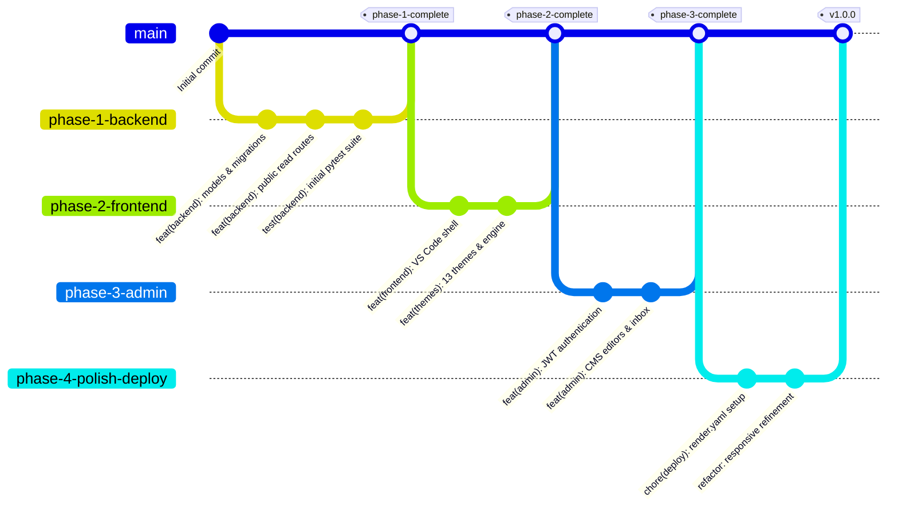

# Git Workflow — PortfolioOS

| Attribute | Value |
| --- | --- |
| **Document Name** | Git Workflow & Version Control Standards |
| **Product Name** | PortfolioOS |
| **Document Version** | 1.0 |
| **Status** | Approved |
| **Release** | PortfolioOS v1.0 |
| **Last Updated** | September 2026 |
| **Target Repository** | [github.com/Ibrahim-2005/portfolio](https://github.com/Ibrahim-2005/portfolio) |

---

## 1. Overview

PortfolioOS maintains a clean, readable Git history mapped to functional deliverables and phases. A structured Git history ensures the repository serves as an authentic artifact of software engineering discipline- reviewers browsing the commit log see a deliberate, verified progression rather than ad-hoc commits.

---

## 2. Commit Message Standards (Conventional Commits)

All commits follow the **Conventional Commits** specification:

```
<type>(<scope>): <short summary>

[optional body — explaining the rationale, not just repeating the diff]
```

### 2.1 Commit Types

- `feat`: New user-facing or administrative functionality.
- `fix`: Bug fix in backend, frontend, or styles.
- `refactor`: Code change that neither fixes a bug nor adds a feature.
- `chore`: Tooling, build scripts, dependencies, or environment updates.
- `docs`: Documentation updates or additions.
- `test`: Adding or updating automated test suites.
- `style`: Formatting, whitespace, or lint-driven cosmetic adjustments.

### 2.2 Scopes

Scopes identify the affected component:

- `backend`: FastAPI routes, schemas, models, services, or database migrations.
- `frontend`: VS Code desktop shell, tabs, views, or mobile drawer.
- `admin`: Administration portal, CMS editors, or auth handling.
- `themes`: Theme CSS variables, theme switching, or cursor engine.
- `terminal`: Integrated CLI emulator, bash sessions, or command registry.
- `ci`: GitHub Actions workflows or automated testing configurations.
- `deploy`: Render configurations, startup commands, or environment variables.

### 2.3 Verified Examples from Repository History

```
feat(backend): scaffold FastAPI project structure and SQLAlchemy models
feat(backend): add public sidebar, projects, and skills read endpoints
feat(backend): add contact message endpoint with SlowAPI rate limiting
chore(backend): seed database with real projects, skills, and bio content
test(backend): add pytest coverage for admin auth and CRUD endpoints

feat(frontend): build desktop VS Code layout (sidebar, tabs, terminal, statusbar)
feat(frontend): wire sidebar and tabs to live database section data
feat(themes): implement 10 base editor themes with command palette switcher
feat(themes): add Project Hail Mary, Interstellar, and F1 easter-egg themes
feat(frontend): implement responsive breakpoints and touch drawer navigation
feat(frontend): add global keyboard shortcut registry

feat(admin): add JWT auth and protected admin CRUD routes
feat(admin): build content editors for pages, projects, and skills
feat(admin): add messages inbox and analytics dashboard

feat(frontend): add resume inline canvas preview and direct download
chore(ci): add GitHub Actions workflow for lint and pytest
docs: finalize architecture and technical reference specifications
```

---

## 3. Branching Strategy

The repository follows a clean, phase-oriented branching model:



### Branch Roles

- **`main`**: The authoritative, production-ready branch. Deployed automatically to Render. Every commit on `main` must pass all tests and lint checks.
- **Phase Branches**: Structured feature branches for major product milestones (`phase-1-backend`, `phase-2-frontend`, `phase-3-admin`, `phase-4-polish-deploy`).
- **Fix / Feature Branches**: Short-lived branches for targeted refinements (`fix/ci-ruff`, `feat/mobile-navigation`).

---

## 4. Release Tagging

Milestones and official versions are marked with annotated Git tags:

- **Phase Milestones**: `phase-1-complete`, `phase-2-complete`, `phase-3-complete`, `phase-4-complete`.
- **Official Releases**: Semantic version tags (e.g. `v1.0.0`).

To create an annotated release tag:

```bash
git tag -a v1.0.0 -m "PortfolioOS v1.0 — Initial Production Release"
git push origin v1.0.0
```

---

## 5. Commit Granularity & Cleanliness

1. **Atomic Commits**: One commit per working feature, fix, or verified checklist item. Avoid combining unrelated changes across backend and frontend into single massive commits.
2. **Commit Message Body**: When the rationale behind a technical decision is not obvious from the title alone, provide a brief explanation in the commit body (e.g., explaining why resume PDFs are stored in PostgreSQL binary columns to survive container restarts).
3. **No Unfinished Commits**: Never commit broken code, syntax errors, or failing tests to `main`.
4. **Zero Secrets in History**: Never commit API keys, database credentials, or `.env` files. If a secret is accidentally committed, rotate the credential immediately.

---

## 6. Continuous Integration (CI) Enforcement

Every push and pull request to `main` automatically triggers the GitHub Actions CI pipeline (`.github/workflows/ci.yml`):

- Spawns a PostgreSQL 16 test database.
- Runs Alembic migrations (`alembic upgrade head`).
- Runs the Ruff linter (`ruff check .`).
- Runs all 107 test cases via Pytest (`pytest`).

Developers must run `ruff check .` and `pytest` locally before pushing to ensure CI passes on the first run.
