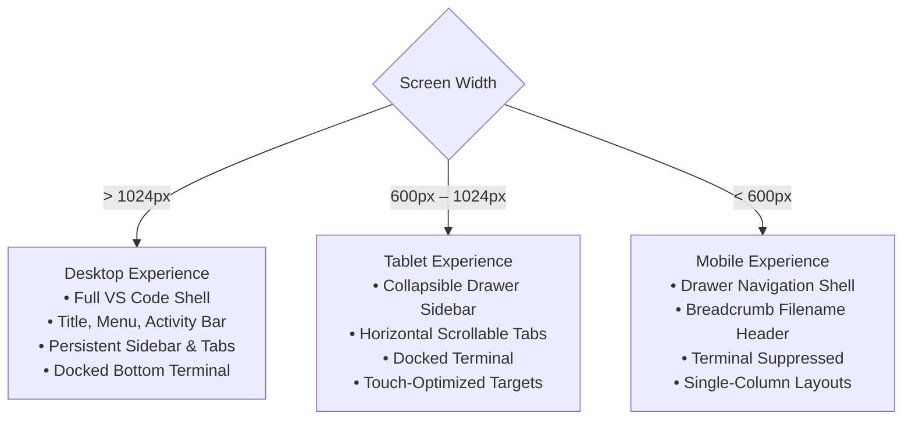

# Product Requirements Document (PRD) — PortfolioOS

| Attribute | Value |
| --- | --- |
| **Document Name** | Product Requirements Document |
| **Product Name** | PortfolioOS |
| **Document Version** | 1.0 |
| **Status** | Approved |
| **Release** | PortfolioOS v1.0 |
| **Last Updated** | September 2026 |
| **Target Repository** | [github.com/Ibrahim-2005/portfolio](https://github.com/Ibrahim-2005/portfolio) |

---

## 1. Product Overview

PortfolioOS is an interactive, developer-focused portfolio application presented as a high-fidelity Visual Studio Code-inspired environment.

Rather than relying on a conventional portfolio template, PortfolioOS presents portfolio information-including projects, technical skills, biography, academic history, contact channels, and resume-through the interface of a modern code editor.

The application is powered by a FastAPI REST API, PostgreSQL, and a modular vanilla JavaScript/CSS frontend. The portfolio itself serves as a demonstration of software engineering capability through its backend architecture, database design, REST API implementation, responsive UI engineering, accessibility considerations, theme system, analytics, and authenticated content administration.

---

## 2. Product Vision & Problem Statement

### 2.1 Product Vision

PortfolioOS is designed to communicate two things simultaneously:

- **Who the engineer is**: Background, technical capabilities, education, projects, and engineering interests.
- **How the engineer builds software**: Architecture, code organization, UI/UX decisions, defensive programming, testing, and production-oriented engineering practices.

The goal is to transform portfolio review from passive browsing into a memorable and technically meaningful exploration.

### 2.2 Problem Statement

Traditional software-engineering portfolios commonly face several problems:

- **Generic presentation**: Interchangeable templates make candidates difficult to differentiate.
- **Unproven technical claims**: Resumes can list technologies without demonstrating implementation ability.
- **Maintenance overhead**: Portfolio updates may require source-code changes and redeployment.
- **Poor responsive adaptation**: Interfaces designed primarily for desktop can become difficult to navigate on smaller devices.

PortfolioOS addresses these problems by functioning as a live full-stack application with a CMS, responsive interfaces, interactive engineering features, and publicly inspectable technical artifacts.

---

## 3. Product Goals & Non-Goals

### 3.1 Primary Goals

#### Recruiter Clarity

Enable technical and non-technical recruiters to quickly access essential information such as:

- About
- Projects
- Skills
- Education
- Resume
- Contact

#### Technical Credibility

Demonstrate engineering capability through:

- FastAPI backend
- PostgreSQL persistence
- REST APIs
- Authenticated administration
- Interactive terminal
- Source-control information
- Automated testing
- Responsive UI engineering
- Public GitHub repository

#### Dynamic Content Management

Allow the portfolio owner to manage portfolio content through the authenticated admin CMS without requiring source-code changes for routine content updates.

#### Multi-Device Usability

Provide:

- A complete VS Code-inspired experience on desktop/laptop
- A hybrid touch-oriented experience on tablets
- A streamlined touch-first experience on phones

#### Production-Oriented Quality

Maintain:

- Reliable API behavior
- Defensive error handling
- Responsive layouts
- Accessible interaction patterns
- Theme consistency
- Automated regression coverage

### 3.2 Non-Goals

The following are explicitly outside the scope of the current release:

- **Arbitrary server code execution**: The terminal is a controlled client-side portfolio CLI.
- **Multi-tenant SaaS**: PortfolioOS supports a single portfolio owner/admin.
- **Public user accounts**: Visitors do not register or maintain accounts.
- **Full browser IDE**: The application uses an editor metaphor rather than functioning as a general-purpose code editor or compiler.
- **Blogging/social-network functionality**: No social feed, threaded discussions, or user-to-user messaging platform.

---

## 4. Target Audiences & User Personas

| Audience | Primary Need | Typical Journey |
| --- | --- | --- |
| **Technical Recruiter** | Quickly assess skills, projects, education and resume | Home &rarr; Projects &rarr; Skills &rarr; Resume &rarr; Contact |
| **Hiring Manager / Senior Engineer** | Evaluate engineering depth and implementation quality | Projects &rarr; Terminal &rarr; Source Control &rarr; GitHub |
| **Non-Technical HR** | Understand the candidate without needing technical knowledge | Home &rarr; About &rarr; Resume &rarr; Contact |
| **Freelance / Client Prospect** | Evaluate shipped work and capabilities | Home &rarr; Projects &rarr; Live demos &rarr; Contact |
| **Portfolio Owner / Admin** | Maintain portfolio content and review submissions | `/admin` &rarr; Authenticate &rarr; Manage content |

---

## 5. Product Principles

- **Professionalism Before Novelty**: The editor metaphor must improve discovery rather than obstruct it.
- **Instant Scannability**: Important career information should remain easy to understand even when visitors ignore interactive features.
- **Progressive Adaptation**: Desktop provides the complete environment, tablets use a hybrid experience, and phones use a streamlined touch-first interface.
- **API-First Architecture**: Portfolio content is persisted in PostgreSQL and exposed through FastAPI APIs.
- **Defensive Reliability**: Features should provide sensible empty states, error handling, validation, rate limiting, and safe client-side storage.
- **Accessibility by Default**: Components should provide semantic structure, visible focus states, keyboard support where applicable, appropriate touch targets, and accessible labels.

---

## 6. Functional Requirements

### 6.1 Portfolio Shell & Chrome

#### 6.1.1 Desktop Experience (> 1024px)

The desktop experience provides the complete VS Code-inspired shell.

- **Title Bar**: Displays decorative window controls, active filename, and PortfolioOS branding.
- **Menu Bar**: Provides desktop navigation through `File`, `Edit`, `View`, `Go`, `Run`, `Terminal`, and `Help`.
- **Activity Bar**: Provides access to:
  - Explorer
  - Search / Quick Open
  - Source Control
  - Terminal
  - Download Resume
  - Settings
- **Sidebar**: Provides:
  - Portfolio file tree
  - Active section state
  - Theme companion area
  - Navigation controls
- **Tab Bar**: Displays opened portfolio files, file-type icons, active tab state, and close controls.
- **Content Pane**: Renders the active portfolio section. Supported content includes:
  - Structured text
  - Project cards
  - Skill matrices
  - Forms
  - Markdown-style content
  - Resume preview
- **Status Bar**: Displays contextual information such as:
  - Git branch
  - Commit information
  - Synchronization state
  - Active theme
  - Contact shortcut
  - Terminal control

#### 6.1.2 Non-Desktop Experience (≤ 1024px)

Desktop-only chrome is suppressed to maximize usable space.

The non-desktop experience provides:

- Compact mobile/tablet navigation header
- Hamburger navigation
- Active filename/breadcrumb
- Sidebar drawer
- Settings access
- Source Control summary
- Touch-friendly controls

The sidebar drawer can be dismissed through its close control, backdrop interaction, or appropriate navigation actions.

---

### 6.2 File-Based Portfolio Navigation

Portfolio sections are represented as virtual files.

| Virtual File | Content |
| --- | --- |
| `home.py` | Hero landing page and portfolio overview |
| `about.html` | Biography, engineering journey and personal profile |
| `projects.sql` | Projects and shipped applications |
| `skills.json` | Technical skills grouped by domain |
| `Mohamed_Ibrahim_Resume.pdf` | Resume viewer and download |
| `contact.jwt` | Contact channels and contact form |
| `README.md` | PortfolioOS technical documentation |

The file names are part of the visual metaphor and do not imply that the underlying portfolio content is stored as those literal source files.

---

### 6.3 Theme System

PortfolioOS provides 13 switchable themes.

#### 6.3.1 Theme Catalog

- **Dark Themes**:
  - Dark+
  - Dracula
  - One Dark Pro
  - Monokai
  - Nord
  - Solarized Dark
  - Night Owl
- **Light Themes**:
  - Light+
  - Solarized Light
  - GitHub Light
- **Special Themes**:
  - **Project Hail Mary**: Includes space-inspired palette, custom cursor treatment
  - **Interstellar**: Includes cosmic visual palette, particle cursor effect.
  - **F1**: Includes racing-inspired palette, racing visual treatment.

#### 6.3.2 Theme Requirements

Each theme must provide consistent visual tokens across the application.

Theme selection:

- Updates the UI without a full page reload
- Persists across sessions
- Handles client-storage failures defensively
- Maintains readability across application surfaces

Special theme animations should respect reduced-motion preferences and avoid unnecessary effects on touch devices.

---

### 6.4 Interactive Terminal

PortfolioOS provides a controlled interactive terminal styled after a developer terminal.

#### 6.4.1 Terminal Commands

- **Navigation**: `about`, `projects`, `skills`, `education`, `resume`, `contact`, `socials`, `clear`
- **Information**: `help`, `whoami`
- **Theme**: `theme <name>`
- **Easter Egg**: `sudo hire-me`

The terminal does not execute arbitrary server-side commands.

#### 6.4.2 Terminal Interface

The terminal supports:

- Command prompt
- Command suggestions
- Command history
- Keyboard navigation
- Autocomplete
- Terminal sessions
- Clear output
- Maximize/collapse controls
- Close controls
- Analytics telemetry

---

### 6.5 Command Palette & Quick Open

- **Desktop**: Supported workflows include:
  - `Ctrl/Cmd + Shift + P` for Command Palette.
  - `Ctrl/Cmd + P` for Quick Open.
  - Relevant VS Code-inspired keyboard chords may also be supported.
- **Mobile & Tablet**: The palette provides a touch-oriented interface with:
  - Search
  - Large touch targets
  - File selection

Desktop keyboard-specific UI hints are not required in the non-desktop experience.

---

### 6.6 Resume Management & Delivery

PortfolioOS provides an integrated resume experience.

- **Visitor Features**: Inline resume viewing, PDF download, and external PDF opening.
- **Mobile**: Phone devices use a browser-compatible PDF rendering approach to provide an inline preview.
- **Storage**: The current implementation stores the resume within PostgreSQL so that the uploaded document persists independently of ephemeral application containers.
- **Administration**: The admin CMS allows the administrator to replace the active resume without modifying application source code.

---

### 6.7 Contact Channels & Messaging

PortfolioOS provides direct contact channels including:

- Email
- LinkedIn
- GitHub

The server-backed contact form supports:

- Full Name
- Email
- Phone (optional)
- Subject

Input is validated on the client and server. Public submissions are rate-limited to reduce abuse.

Submitted messages are stored in PostgreSQL and provide:

- Read/unread state
- Message detail
- Administrative review

---

### 6.8 Source Control Telemetry

PortfolioOS exposes repository information through its Source Control interface.

The feature can display:

- Active branch
- Latest commit
- Short commit SHA
- Commit author
- Relative commit timing
- Repository change statistics
- GitHub repository link

On non-desktop devices, Source Control is available within the navigation drawer.

---

### 6.9 Admin CMS

PortfolioOS includes a dedicated administration interface at `/admin`.

#### 6.9.1 Authentication

The admin system uses:

- Single administrator account
- JWT authentication
- Protected admin API endpoints
- Hashed passwords

Administrative endpoints require a valid bearer token.

#### 6.9.2 Admin Capabilities

| Module | Operations |
| --- | --- |
| **Page Configuration** | Read, Update |
| **Sidebar Navigation** | List, Create, Update, Reorder, Delete |
| **Projects** | List, Create, Update, Reorder, Delete |
| **Skills & Domains** | List, Create, Update, Reorder, Delete |
| **Education** | List, Create, Update, Reorder, Delete |
| **Contact Links** | List, Create, Update, Delete |
| **Messages** | List, Inspect, Mark Read / Unread |
| **Resume** | Replace uploaded PDF |
| **Analytics** | View summary metrics |

---

## 7. Responsive Product Model

PortfolioOS uses three primary responsive modes.



### 7.1 Breakpoint Matrix

| Range | Classification | Experience |
| --- | --- | --- |
| **< 600px** | Mobile | Touch-first navigation, drawer sidebar, compact header, single-column layouts |
| **600px – 1024px** | Tablet | Drawer navigation, touch controls, responsive tabs, bottom terminal |
| **> 1024px** | Laptop / Desktop | Full VS Code-inspired shell |

### 7.2 Touch & Ergonomic Standards

The responsive experience should provide:

- Approximately 44×44px minimum touch targets for primary interactive controls
- No essential functionality dependent solely on hover
- Support for viewport zooming
- No unintended horizontal overflow at supported mobile widths
- Appropriate safe-area handling on supported mobile devices

---

## 8. Non-Functional Requirements

### 8.1 Performance

PortfolioOS should:

- Load efficiently on typical broadband and mobile connections
- Avoid unnecessary JavaScript frameworks
- Minimize layout thrashing
- Use efficient animation techniques where animations are required
- Avoid unnecessary network requests
- Remain responsive during normal interaction

Performance targets should be validated through actual measurement rather than treated as unverified guarantees.

### 8.2 Accessibility

PortfolioOS should provide:

#### Visual Accessibility

- Readable typography
- Appropriate contrast
- Visible focus states
- Theme-aware UI states

Theme colors are designed and tested against WCAG AA contrast targets where applicable.

#### Keyboard Accessibility

Desktop interactions should support keyboard navigation for relevant controls.

Global shortcuts should avoid interfering with:

- `input` elements
- `textarea` elements
- `select` elements
- `contenteditable` elements

### 8.3 Security & Data Integrity

The application should enforce:

- JWT protection for administrative operations
- Secure password hashing
- Public endpoint rate limiting
- Pydantic request validation
- Output escaping where applicable
- Strict CORS configuration
- Environment-based secret management
- Database integrity through relational constraints

Sensitive credentials must never be committed to the repository.

---

## 9. Technical Architecture & Constraints

```
┌─────────────────────────────────────────────────────┐
│                    Client Browser                   │
│                                                     │
│ HTML5 + CSS3 + Vanilla JavaScript (ES Modules)      │
│ PDF.js + Theme Engine + Responsive UI               │
└───────────────────────┬─────────────────────────────┘
                        │
                        │ HTTP / JSON REST
                        ▼
┌─────────────────────────────────────────────────────┐
│                   FastAPI Backend                   │
│                                                     │
│ Public API Routes                                   │
│ Admin API Routes + JWT                              │
│ Static Frontend Serving                             │
│ Rate Limiting                                       │
└───────────────────────┬─────────────────────────────┘
                        │
                        │ SQLAlchemy / Alembic
                        ▼
┌─────────────────────────────────────────────────────┐
│                    PostgreSQL                       │
│                                                     │
│ Projects                                            │
│ Skills                                              │
│ Education                                           │
│ Page Configuration                                  │
│ Messages                                            │
│ Resume                                              │
│ Admin Users                                         │
│ Analytics                                           │
└─────────────────────────────────────────────────────┘
```

### 9.1 Technical Constraints

- **Frontend**: PortfolioOS uses modular vanilla JavaScript rather than a frontend framework.
- **Backend**: FastAPI provides the application API and backend services.
- **Database**: PostgreSQL provides persistent relational storage.
- **Deployment**: The backend can serve the frontend as part of a streamlined deployment architecture suitable for platforms such as Render.

---

## 10. Success Criteria

| Category | Success Criterion | Measurement |
| --- | --- | --- |
| **Recruiter Flow** | Essential portfolio information is discoverable quickly | Manual usability testing |
| **Engineering Proof** | Technical reviewers can inspect the application and repository | Live application + GitHub |
| **Content Autonomy** | Portfolio owner can update content without source changes | CMS workflow |
| **Cross-Device Health** | No known horizontal overflow defects across supported viewports | Responsive testing |
| **Backend Reliability** | Automated backend test suite passes successfully | Pytest |
| **Accessibility** | Core interactions remain usable across supported input methods | Accessibility + manual testing |

---

## 11. Risk Assessment & Mitigation

| Risk | Likelihood | Impact | Mitigation |
| --- | --- | --- | --- |
| **Editor Metaphor Confusion** | Low | High | Clear labels and direct CTAs |
| **Mobile Layout Complexity** | Medium | High | Dedicated responsive navigation architecture |
| **Data Loss on Ephemeral Hosting** | Low | High | Persistent PostgreSQL storage |
| **Theme Inconsistency** | Medium | Medium | Theme/token audits across all themes |
| **Animation Performance** | Low | Medium | Efficient transforms and reduced-motion support |
| **Feature Complexity / Scope Creep** | Medium | High | Prioritized implementation and explicit future scope |

---

## 12. Release Definition

PortfolioOS v1.0 is considered complete when:

- Core portfolio sections are accessible
- Desktop, tablet, and mobile experiences are functional
- The admin CMS manages supported content
- Public APIs operate correctly
- Resume viewing/download works
- Contact workflow operates correctly
- Source Control integration functions
- Themes remain visually consistent
- Responsive regression checks pass
- Backend automated tests pass
- Documentation accurately reflects the implemented system
