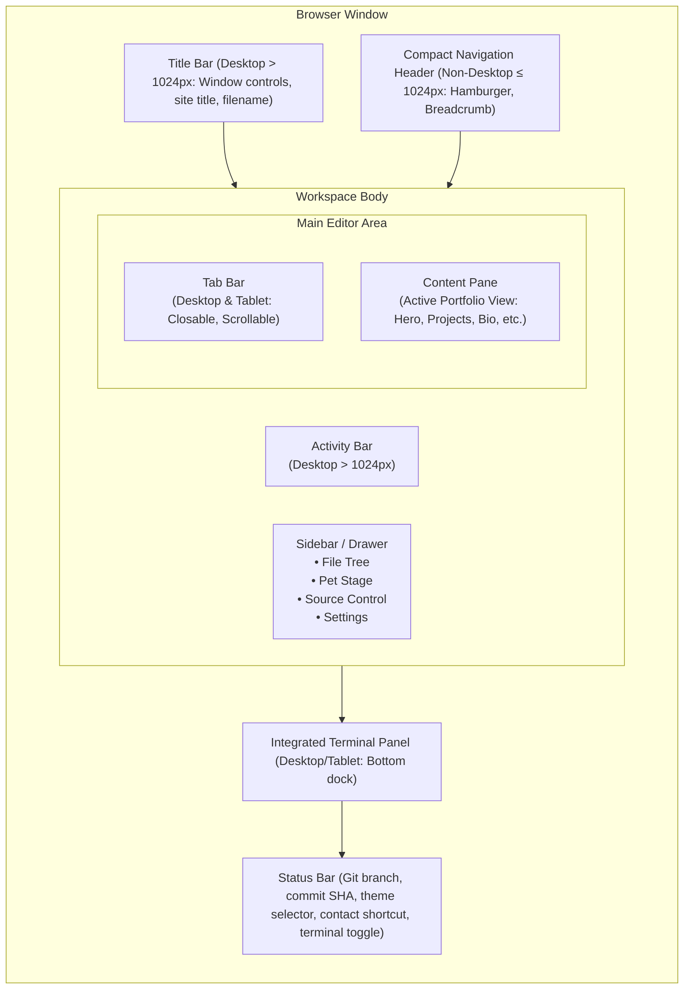
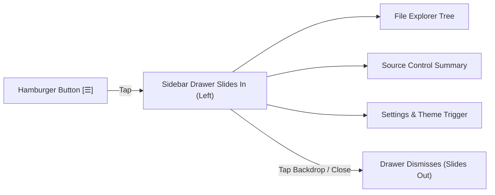

# UI/UX Specification — PortfolioOS

| Attribute | Value |
| --- | --- |
| **Document Name** | UI/UX Specification |
| **Product Name** | PortfolioOS |
| **Document Version** | 1.0 |
| **Status** | Approved |
| **Release** | PortfolioOS v1.0 |
| **Last Updated** | September 2026 |
| **Target Repository** | [github.com/Ibrahim-2005/portfolio](https://github.com/Ibrahim-2005/portfolio) |

---

## 1. Design Philosophy

PortfolioOS is designed around a singular UX thesis: **the code-editor metaphor must enhance, accelerate, and elevate candidate discovery rather than obstructing it.**

Every interaction is styled within a high-fidelity Visual Studio Code operating environment, framing portfolio artifacts as files, terminal commands, source-control metrics, and editor tabs. Visual novelty is balanced against user clarity:

- **Instant Recognition**: Non-technical visitors can immediately read core qualifications, navigate sections, open projects,
and initiate contact without needing prior knowledge of code editors.
- **Progressive Depth**: Technical visitors and hiring managers can engage with terminal commands, inspect Git telemetry, switch developer themes, and explore keyboard shortcuts.
- **Authenticity Without Friction**: Visual details (activity bars, status bars, syntax highlights, pet companions) behave smoothly and predictably, with zero intrusive tutorials or forced onboarding gates.

---

## 2. Experience Architecture

The information architecture organizes the browser window into distinct, purposeful structural regions:



### 2.1 Hierarchy of Regions

1. **Application Chrome**: The outer frame establishing the VS Code metaphor (Title Bar on desktop, Compact Navigation Header on non-desktop, Activity Bar, Status Bar).
2. **Navigation Region**: The Sidebar file explorer and Tab bar, acting as the primary section switchboard.
3. **Primary Content Stage**: The Content Pane, rendering dedicated views for candidate information, project grids, markdown documents, and PDF canvases.
4. **Interactive Utility Region**: The collapsible Terminal Panel and Command Palette overlay for exploratory and keyboard-driven workflows.

---

## 3. Responsive Experience Model

PortfolioOS enforces a three-tier responsive architecture:

| Viewport Category | Width Range | Core UX Model | Navigation & Chrome Strategy |
| --- | --- | --- | --- |
| **Mobile Phone** | `< 600px` | Streamlined Touch-First Shell | Chrome suppressed; compact navigation header; off-canvas sidebar drawer; single-column content cards. |
| **Tablet** | `600px – 1024px` | Hybrid Touch/Editor Experience | Chrome suppressed; collapsible sidebar drawer; horizontal scrollable tab bar; bottom-docked terminal; 2-column project grids. |
| **Desktop / Laptop** | `> 1024px` | Full VS Code Simulation | Complete desktop IDE chrome (Title Bar, Menu Bar, Activity Bar, permanent Sidebar, multi-tab bar, resizable bottom terminal, full status bar). |

---

## 4. Desktop Shell (> 1024px)

### 4.1 Title Bar

- **Height**: 35px.
- **Elements**: Decorative macOS-style window controls (close, minimize, maximize dots), centered site branding (`Mohamed Ibrahim Y — Portfolio`), and active file title.
- **Behavior**: Fixed at the top; provides visual grounding for the desktop editor metaphor.

### 4.2 Menu Bar

- **Items**: `File`, `Edit`, `View`, `Go`, `Run`, `Terminal`, `Help`.
- **Interaction**: Click opens standard IDE dropdown menus with functional action triggers (e.g., Quick Open, Toggle Terminal, Switch Theme, Keyboard Shortcuts, Source Control, Download Resume).
- **Dismissal**: Closes on click outside, item selection, or `Escape` key.

### 4.3 Activity Bar

- **Width**: 60px.
- **Position**: Leftmost vertical column.
- **Actions**:
  - *Explorer*: Toggles Sidebar visibility.
  - *Search*: Opens file quick-search palette.
  - *Source Control*: Opens repository telemetry popover.
  - *Terminal*: Toggles integrated bottom terminal panel.
  - *Download Resume*: Initiates direct resume PDF download.
  - *Settings*: Opens preferences and theme selection drawer.
- **Visual State**: Active tool displays a distinct high-contrast accent border on the left edge.

### 4.4 Sidebar

- **Width**: 250px.
- **Components**:
  - Header: Section title (`PORTFOLIO`) with action buttons.
  - File Explorer: Tree view of virtual portfolio files icons.
- **Behavior**: Collapsible via Activity Bar icon or keyboard shortcut (`Ctrl/Cmd + B`).

### 4.5 Tab Bar

- **Height**: 35px.
- **Features**: Horizontal multi-tab strip; active tab highlighted with theme accent styling; file-type icons; closable via close control (`×`); click or middle-click to switch.
- **Scrolling**: Smooth horizontal scroll when open tabs exceed available width.

### 4.6 Content Pane

- **Position**: Main central stage below tabs and above the terminal panel.
- **Scroll Behavior**: Independent vertical scrolling with custom scrollbars; layout content is padded with comfortable breathing room.
- **Accessibility Landmark**: Configured with appropriate landmark and focus attributes for keyboard bypass and accessibility navigation.

### 4.7 Status Bar

- **Height**: 22px.
- **Left Side**: Git branch indicator (`main`), short commit SHA badge, sync status icon (links to repository).
- **Right Side**: Theme selector pill with active theme icon and name (triggers theme palette), quick Contact button, and Terminal toggle button.

---

## 5. Non-Desktop Navigation (≤ 1024px)



### 5.1 Compact Navigation Header

- Replaces Title Bar and Menu Bar on screens `≤ 1024px`.
- Contains:
  - Hamburger Navigation Button: Touch-friendly area (minimum ~44×44px).
  - Current File Breadcrumb: Monospace filename of the currently active section (e.g., `home.py`, `projects.sql`).
  - Quick Search Icon: Launches touch-optimized search palette.

### 5.2 Sidebar Drawer & Backdrop

- **Transition**: Smooth off-canvas sliding drawer animation from the left.
- **Backdrop**: Semi-transparent dark overlay; tapping the backdrop closes the drawer immediately.
- **Auto-Close**: Selecting any file item dismisses the drawer and navigates to the selected content pane.

### 5.3 Integrated Non-Desktop Sections

- **Source Control**: Integrated into the lower section of the sidebar drawer, displaying current branch, latest commit author/date, change stats, and a repository link.
- **Settings**: Accessible via the gear icon in the drawer header, opening a single-column theme picker and quick actions.

---

## 6. Portfolio File Navigation

| Virtual File | Primary Metaphor | Target Content / View Component | Default Route |
| --- | --- | --- | --- |
| `home.py` | Python Script | Hero intro, role badges, short bio, CTA buttons, social links | Yes (Initial default) |
| `about.html` | HTML Document | Full biography, core focus areas, learning path, personal background | No |
| `projects.sql` | SQL Query / Schema | Shipped applications card grid, tech stacks, highlights, live/repo links | No |
| `skills.json` | JSON Config | Domain-grouped technical skill matrix (Backend, Frontend, Databases, DevOps) | No |
| `Mohamed_Ibrahim_Resume.pdf` | PDF Binary | In-browser PDF canvas preview, PDF download button, external open | No |
| `contact.jwt` | JWT Token / Security | Contact channel links (Email, LinkedIn, GitHub) + server-backed message form | No |
| `README.md` | Markdown Doc | Architecture documentation, tech stack overview, development notes | No |

### 6.1 State Management & Tab Persistence

- Selecting a tree item opens it as the active tab.
- If already open, the existing tab gains active focus; if not open, a new tab is instantiated.
- Open tabs and active tab selection persist across browser reloads via client-side storage with defensive error handling.
- Closing an active tab switches to the nearest adjacent tab; closing all tabs defaults gracefully back to `home.py`.

---

## 7. Content Page UX

### 7.1 Home (`home.py`)

- **Hero Presentation**: Visual landing hero that respects the editor theme and monospace typography.
- **Top Comment**: Monospace comment prefix: `// main.py`.
- **Headline**: High-contrast name display (`Mohamed Ibrahim Y`) with responsive fluid sizing.
- **Role Badges**: Pill-shaped badges highlighting key engineering areas: *Backend Developer*, *Full-Stack*, *Freelancer & Educator*, *Final-Year CSE*.
- **Primary CTAs**:
  - `Projects` (Primary filled accent button &rarr; navigates to `projects.sql`).
  - `About Me` (Outline button &rarr; navigates to `about.html`).
  - `Contact` (Outline button &rarr; navigates to `contact.jwt`).

### 7.2 About (`about.html`)

- **Structure**: Clean document structure with clear section headers (`// who I am · what I build · where I'm headed`).
- **Focus Blocks**: Structured cards for "Current Focus" and "Currently Learning" with emoji highlights.
- **Bio Paragraphs**: Legible, line-height balanced text explaining background, backend engineering focus, and career objectives.

### 7.3 Projects (`projects.sql`)

- **Card Grid**: Responsive grid layout (single-column on mobile `< 600px`, 2-column on tablet `600px–1024px`, up to 3 columns on large desktop).
- **Card Elements**:
  - Project Title & Subtitle.
  - Problem & Solution Overview.
  - Tech Stack Badge Matrix (individual pills with language/tool icons).
  - Key Engineering Highlights (bullet points with highlighted technical achievements).
  - Action Footer: "Live Demo" and "GitHub Repo" external link buttons with outbound arrow indicators (`↗`).
- **Empty State**: Renders a graceful placeholder if no projects are retrieved.

### 7.4 Skills (`skills.json`)

- **Grouping**: Grouped into technical domains: *Backend*, *Databases*, *Frontend*, *Testing & Delivery*, *Engineering Practices*
- **Proficiency Badges**: Distinct badges indicating proficiency depth (*Core*, *Hands-on*, *Working*).

### 7.5 Education (`education.md`)

- **Timeline Presentation**: Chronological academic cards detailing Institution, Degree, Grade, and Core Coursework.

### 7.6 Resume (`Mohamed_Ibrahim_Resume.pdf`)

- Integrated PDF canvas preview, action header with download button (`/api/resume`), and external viewing options.

### 7.7 Contact (`contact.jwt`)

- Direct contact links + server-backed contact form with client/server validation, status messages, and rate limit protection.

### 7.8 README (`README.md`)

- Formatted technical overview of PortfolioOS architecture, stack, deployment, and local setup instructions.

---

## 8. Terminal UX

```
guest@portfolio:~$ help
Available commands:
  about       - Short bio & background
  projects    - List featured projects
  skills      - Technical skills matrix
  education   - Academic qualifications
  resume      - Download resume PDF
  contact     - Reach out & contact links
  socials     - GitHub, LinkedIn, Email
  theme <name>- Switch active theme (13 available)
  clear       - Clear terminal output
  sudo hire-me- Easter egg command
```

### 8.1 Terminal Placement & Interaction

- **Desktop / Tablet (≥ 600px)**: Bottom docked panel with top resize border, title bar, tab sessions (`1: bash`), clear button (`⊘`), maximize button (`⤢`), and close button (`×`).
- **Command Suggestions**: Clickable command pills rendered above the prompt for fast command discovery.
- **History Navigation**: Up/Down arrow keys cycle through previous command history.
- **Tab Autocomplete**: Pressing `Tab` autocompletes partially typed command names and arguments.

---

## 9. Command Palette & Quick Open

### 9.1 Desktop Keyboard Workflows

- `Ctrl/Cmd + Shift + P`: Opens Command Palette in Action Mode (`>`) to execute registered commands, switch themes, or toggle panels.
- `Ctrl/Cmd + P`: Opens Quick Open in File Search Mode and immediately open portfolio files.
- `Ctrl/Cmd + K` Chords: Supports `Ctrl+K -> T` (Theme Picker), `Ctrl+K -> S` (Shortcuts Reference) and `Ctrl+K -> W` (Closes all tabs).

### 9.2 Mobile & Tablet Touch Search

- Activated via the search icon in the Compact Navigation Header.
- Centered touch modal with immediate auto-focus, real-time query filtering, high-contrast file icons, and large tap rows (minimum ~44×44px).
- Displays empty state feedback ("No matching files or commands") when queries yield zero results.
- Dismissed via tap outside, Escape key, or close control.

---

## 10. Settings UX

- **Desktop**: Accessible via Activity Bar gear icon or Command Palette; opens a popover pane with Theme catalog, Fullscreen toggle, and Resume download action.
- **Mobile / Tablet**: Accessible via Sidebar drawer header; presents a vertically scrollable view with a single-column theme list and touch-enabled quick action buttons.
- **Theme Selection**: Active theme is marked with a clear checkmark (`✓`) and active background indicator; selecting any theme applies it instantly across all open views and updates the Status Bar.

---

## 11. Theme System UX

PortfolioOS provides **13 switchable themes** designed for visual consistency across standard and special theme treatments:

| Theme Name | Tone | Category | Special Companion / Visual Treatment |
| --- | --- | --- | --- |
| **Dark+** | Dark | Standard IDE | Default VS Code dark aesthetic; classic blue accent. |
| **Dracula** | Dark | Standard IDE | High-contrast purple/pink accents with dark slate background. |
| **One Dark Pro** | Dark | Standard IDE | Atom-inspired balanced dark theme with cyan/blue accents. |
| **Monokai** | Dark | Standard IDE | Vibrant magenta and yellow highlights. |
| **Nord** | Dark | Standard IDE | Arctic, bluish-gray muted aesthetic. |
| **Solarized Dark** | Dark | Standard IDE | Teal and cyan-tinted low-fatigue palette. |
| **Night Owl** | Dark | Standard IDE | Deep blue/purple night coding palette. |
| **Light+** | Light | Standard IDE | Clean, crisp white editor aesthetic. |
| **Solarized Light** | Light | Standard IDE | Warm amber/cream reading palette. |
| **GitHub Light** | Light | Standard IDE | Clean GitHub web aesthetic with classic blue accents. |
| **Project Hail Mary** | Dark (Warm) | Special Easter Egg | Warm rust/amber space palette; pixel-dot cursor; animated *Rocky* companion. |
| **Interstellar** | Dark (Cosmic) | Special Easter Egg | Deep space black/navy; accretion-disk glow; particle trail cursor; animated *TARS* companion. |
| **F1** | Dark (Racing) | Special Easter Egg | Racing red/carbon palette; checkered flag accents; crosshair cursor; animated *F1 Car* companion. |

### 11.1 Theme Surface & Text Hierarchy

- **Main Surface (`--bg-main`)**: Primary content stage background.
- **Sidebar Surface (`--bg-sidebar`)**: Sidebar and drawer background (subtly offset for visual depth).
- **Chrome Framing (`--bg-titlebar`, `--bg-statusbar`)**: Header and footer framing surfaces.
- **Tab Distinctions (`--bg-tab-active`, `--bg-tab-inactive`)**: Clear visual distinction for active vs background editor tabs.
- **Accent Tokens (`--accent`, `--accent-strong`)**: Interactive buttons, active tab indicators, focus rings.
- **Text Readability (`--fg-main`, `--fg-muted`)**: Primary body text vs secondary metadata, targeting readable contrast across all themes.

---

## 12. Resume UX

- **Inline Rendering**: The resume is rendered inline using an embedded PDF viewer on desktop and tablet, with PDF.js canvas rendering used on mobile for browser-compatible responsive viewing.
- **Download Action**: Prominent button (`Download PDF`) directly requests `/api/resume`, triggering file download.
- **External View**: Option to open the resume PDF in a new browser tab.
- **Mobile Compatibility**: Renders canvas pages sequentially with touch-friendly vertical scrolling.
- **Loading & Error Handling**: Displays skeleton shimmer during initial load; renders retry options if PDF streaming fails.

---

## 13. Contact Form

- **Form Layout**: Vertical stack with labeled inputs (`Full Name`, `Email Address`, `Phone (optional)`, `Subject`, `Message`).
- **Validation**:
  - Client-side pre-validation (valid email format, required fields).
  - Server-side validation with clear user-facing error feedback.
- **Submission Feedback**:
  - Button transitions to loading state (`Sending...`).
  - On Success: Confirmation banner ("Thank you! Your message has been sent successfully.").
  - On Error: Inline alert with helpful error explanation.
  - Rate Limiting: Protected against spam flooding with clear feedback when throttled.

---

## 14. Source Control UX

- **Information Display**:
  - Active Branch (e.g., `main`).
  - Short Commit SHA.
  - Latest Commit Message and Author.
  - Relative Commit Timing.
  - Modified, Added, and Deleted file count badges.
  - "View on GitHub" outbound link with arrow indicator (`↗`).
- **Presentation**:
  - Desktop: Popover anchored to the Activity Bar Source Control icon.
  - Non-Desktop: Integrated directly into the lower drawer of the Sidebar.
- **Fallback**: Gracefully displays repository link and synchronization state if API telemetry is unreachable.

---

## 15. Admin CMS UX (`/admin`)

The Admin CMS is a dedicated administration console designed for rapid content maintenance:

### 15.1 Authentication Flow

- Clean modal login with Email and Password inputs.
- Obtains signed JWT bearer token stored in secure session storage.
- Immediate redirect to dashboard upon successful authentication.

### 15.2 Management Workflows

- **Page Configurations**: Form editors for managing core singleton sections (`home`, `about`, `contact`, `readme`).
- **Sidebar Items**: List view with reordering, label editing, icon customization, and visibility toggles.
- **Projects CRUD**: Form for creating/editing projects, managing tech stack tags with icons, entering highlight bullets, and toggling featured flags.
- **Skills & Domains**: Hierarchical manager for domain categories and skill proficiency levels.
- **Education**: Form manager for degrees, institutions, grades, and academic dates.
- **Contact Links**: Manager for social channels and binary custom icon uploads.
- **Messages Inbox**: List view of incoming contact submissions with read/unread toggle and full message viewer (deletion is intentionally omitted in v1.0).
- **Resume Upload**: File dropzone to upload a replacement PDF binary, updating the database record.
- **Analytics Dashboard**: Aggregated summary charts of page views and popular terminal commands.

---

## 16. Component & Interaction Standards

### 16.1 Buttons

- **Primary**: Solid accent fill, high-contrast text, subtle hover lift.
- **Outline**: 1px solid accent border, accent text, soft background hover.
- **Ghost**: Transparent background, subtle hover highlight.
- **Touch Target**: Minimum ~44×44px touch area on touch devices.

### 16.2 Form Controls

- **Inputs & Textareas**: Themed backgrounds, distinct subtle borders, rounded corners (`--radius-sm: 6px`), comfortable text padding, and high-contrast focus rings.
- **Focus Rings**: Distinct focus outline (`2px solid var(--accent); outline-offset: 2px;`) across all keyboard-focusable controls.
- **Placeholders**: Muted foreground color providing clear guidance.

### 16.3 Badges & Chips

- **Tech Stack Badges**: Compact pill-shaped tags with monospace font, subtle background tint, and tool/language icons.

### 16.4 Cards

- **Project & Focus Cards**: Semi-transparent elevated surfaces with subtle borders, comfortable internal padding, and responsive grid alignment.
- **Card Hover**: Subtle visual lift and accent border highlight on mouse-enabled viewports.

---

## 17. Typography & Spacing Scale

### 17.1 Font Families

- **UI Font**: `'Inter', 'Segoe UI', Tahoma, Geneva, Verdana, sans-serif` (`--font-ui`).
- **Display Font**: `'Syne', 'Inter', 'Segoe UI', sans-serif` (`--font-display`).
- **Monospace Code Font**: `'JetBrains Mono', 'Cascadia Code', 'Consolas', monospace` (`--font-code`).

### 17.2 Sizing & Spacing Scale

- **Base Body**: 13px / line-height 1.5 (standard IDE proportion).
- **H1 (Display)**: Fluid sizing (`clamp(1.8rem, 4vw, 2.5rem)`), bold weight.
- **H2 (Section)**: 1.4rem, semi-bold weight.
- **H3 (Subheader)**: 1.15rem, medium-bold weight.
- **Code / Terminal**: 13px – 14px, monospace.
- **Border Radii**: `--radius-sm: 6px; --radius-md: 8px;`.
- **Spacing Scale**: 4px, 8px, 12px, 16px, 24px, 32px, 48px.

---

## 18. Accessibility Standards

- **Color Contrast**: Primary reading text, links, and active controls are designed to target a minimum contrast ratio of **4.5:1** against their respective backgrounds (WCAG AA target).
- **Skip Navigation**: Keyboard users can press `Tab` on initial page load to focus the `.skip-link` button and bypass application chrome directly to main content.
- **Focus Indicators**: Visible `:focus-visible` outlines across all interactive controls.
- **Keyboard Shortcuts Safety**: Global keyboard listeners actively check focused elements and bypass shortcuts whenever `input`, `textarea`, `select`, or `contenteditable` elements are active.
- **Touch Target Floor**: Interactive controls on mobile and tablet maintain a target hitbox of approximately **44 × 44 pixels**.
- **Zoom Support**: Viewport zooming remains enabled (`user-scalable=yes`) to ensure user accessibility.
- **Screen Reader Labels**: Non-text controls, icon buttons, and badges include meaningful `aria-label`, `aria-hidden`, and landmark roles.

---

## 19. Motion & Microinstructions

- **Timing**: Fluid transitions (160ms–320ms) for panel toggles, drawer slides, and button hover states.
- **Smooth Rendering**: Animations should remain visually smooth and responsive on supported devices.
- **Reduced Motion**: When `@media (prefers-reduced-motion: reduce)` is detected, transitions and animations are minimized or disabled, and pet companions remain stationary.

---

## 20. Responsive QA Matrix

| Viewport (px) | Device Category | Key Verification Requirements |
| --- | --- | --- |
| **360 × 800** | Small Smartphone | No unintended horizontal overflow; hamburger menu functional; single-column cards. |
| **375 × 667** | Compact Phone | Legible hero typography; touch targets ~44px; contact form inputs fully accessible. |
| **390 × 844** | Standard Phone | Safe-area padding respected; PDF canvas scrolls smoothly; bottom status bar readable. |
| **430 × 932** | Large Phone | Balanced card padding; full-width search palette cleanly centered. |
| **600 × 800** | Small Tablet | Tab strip restores horizontal scrolling; drawer navigation operates smoothly. |
| **768 × 1024** | Standard Tablet | 2-column project cards; terminal bottom-docked; touch theme selection responsive. |
| **834 × 1112** | Large Tablet | Tab bar multi-open support; search modal properly dimensioned. |
| **1024 × 768** | Tablet Landscape | Drawer overlays workspace cleanly without content clipping. |
| **1280 × 720** | Compact Laptop | Full desktop chrome active; Title Bar, Menu Bar, Activity Bar, Sidebar all visible. |
| **1366 × 768** | Standard Laptop | Balanced vertical rhythm; terminal resizable without breaking content pane. |
| **1440 × 900** | Desktop Display | Golden layout reference; crisp borders; pet companion active in sidebar. |
| **1920 × 1080** | Full HD Monitor | Balanced visual fidelity; no unintended whitespace; readable theme contrast. |

---

## 21. UX Error, Empty & Loading States

| Context | Loading State | Error State | Empty State |
| --- | --- | --- | --- |
| **Content Views** | Shimmer skeleton cards | Inline alert with retry action | Graceful placeholder: "No entries found." |
| **Projects** | Skeleton card shimmer with tag placeholders | Border banner with retry action | "No projects available at this time." |
| **Terminal** | Blinking terminal cursor | "command not found. Type 'help' for available commands." | Clear terminal output with welcome system message |
| **Resume** | PDF canvas loader indicator | "Unable to load PDF preview. [Download File]" fallback | "Resume document unavailable." |
| **Search Palette** | Immediate query debounce | None | "No matching files or commands found." |
| **Contact Form** | Button indicator: `Sending...` | Inline error message above submit button | Clean empty form fields with helpful placeholders |
| **Source Control** | "Loading repository status..." | "Unable to load repository status. [View on GitHub ↗]" | "Repository synchronized." |

---

## 22. Design Constraints

1. **Modular Vanilla Architecture**: Built using modular vanilla JavaScript and CSS without heavy framework dependencies to ensure fast initial load and low runtime overhead.
2. **Editor Metaphor Preservation**: Maintain authentic VS Code structural chrome without turning the portfolio into an unapproachable text editor.
3. **Single-Service Deployment**: Designed to run seamlessly as a unified application serving the static frontend directly from the backend service.
4. **Ephemerality Resilience**: Database-backed binary storage for uploaded resume PDFs ensuring persistence across container restarts on ephemeral hosting.

---

## 23. Implementation Alignment Notes

### Confirmed Implementation

- **Responsive Terminal**: Docked resizable panel on tablet/desktop (≥ 600px).
- **Tablet Tabs**: Horizontal scrolling tab bar enabled for tablets (`600px–1024px`); compact section header on mobile phones (`< 600px`).
- **13 Themes**: 10 standard editor themes + 3 special easter egg themes (Project Hail Mary, Interstellar, F1) with animated companion sprites.
- **Admin Message Deletion Guard**: The Messages module intentionally omits a deletion action in v1.0, preserving visitor contact submissions for administrative record-keeping.

### Documentation Clarification

- **Virtual File Extensions**: Virtual filenames (`home.py`, `about.html`, `projects.sql`, `skills.json`, `education.md`, `Mohamed_Ibrahim_Resume.pdf`, `contact.jwt`, `README.md`) represent navigational metaphors rather than literal static disk files
