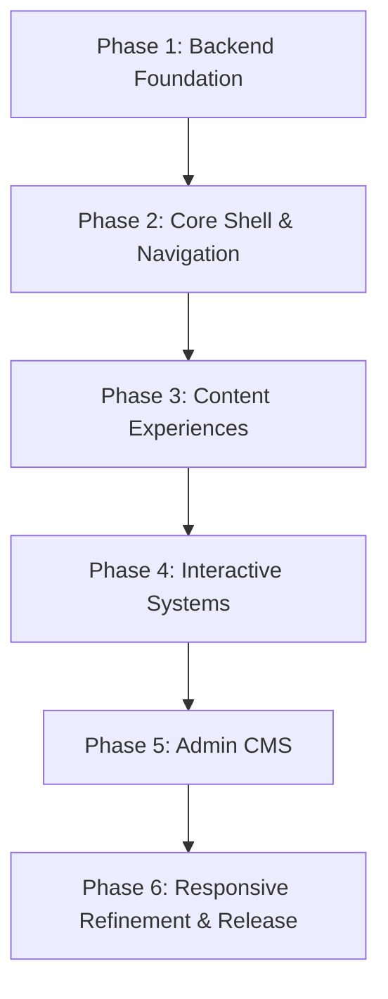

# Implementation Plan — PortfolioOS

| Attribute | Value |
| --- | --- |
| **Document Name** | Implementation Plan |
| **Product Name** | PortfolioOS |
| **Document Version** | 1.0 |
| **Status** | Approved |
| **Release** | PortfolioOS v1.0 |
| **Last Updated** | September 2026 |
| **Target Repository** | [github.com/Ibrahim-2005/portfolio](https://github.com/Ibrahim-2005/portfolio) |

---

## 1. Document Purpose

This document defines the official engineering implementation strategy for PortfolioOS v1.0.

It translates the approved product requirements and approved UI/UX behavior into an ordered implementation plan covering:

- Implementation phases
- Frontend and backend strategy
- Content rendering
- Admin CMS
- Responsive behavior
- Interactive systems
- Security
- Accessibility
- Performance
- Testing
- Quality assurance
- Release readiness

The Implementation Plan is intentionally focused on implementation sequencing and execution strategy.

Detailed API contracts, database definitions, exact project structure, deployment procedures, and other implementation-specific references are maintained in their respective development and architecture documents rather than duplicated here.

PortfolioOS is designed as a full-stack developer portfolio using a FastAPI backend, PostgreSQL persistence, and a modular vanilla JavaScript/CSS frontend.

---

## 2. Implementation Principles

Implementation of PortfolioOS follows the following principles:

### 2.1 API-Driven Architecture

Portfolio content and dynamic functionality are backed by the FastAPI service and PostgreSQL database.

The frontend consumes the API and is responsible primarily for:

- Navigation
- State
- Rendering
- Interaction
- Responsive presentation
- Client-side utilities

The implementation must avoid duplicating authoritative content in static frontend markup when that content is intended to be CMS-managed.

### 2.2 Framework-Free Frontend

The public frontend uses:

- HTML
- CSS
- Modular vanilla JavaScript

A heavy frontend framework is intentionally avoided.

The goal is to keep the application lightweight, understandable, maintainable, and representative of deliberate frontend engineering rather than framework dependency.

The product requirements explicitly establish modular vanilla JavaScript as the frontend approach.

### 2.3 Progressive Responsive Adaptation

PortfolioOS retains the same underlying experience across supported devices while adapting the amount and arrangement of visible interface chrome.

The three responsive modes are:

- **Mobile**: `< 600px`
- **Tablet**: `600px–1024px`
- **Desktop**: `> 1024px`

The UI/UX specification defines dedicated behavior for sidebar navigation, tabs, terminal, pets, cursors, and command palette across these modes.

### 2.4 Progressive Depth

The implementation must support two simultaneous experiences:

#### Immediate Experience

A non-technical recruiter should quickly understand:

- Who the candidate is
- What they build
- Their skills
- Their projects
- How to contact them

#### Technical Depth

A technical visitor should be able to explore:

- Terminal interaction
- Themes
- Keyboard shortcuts
- Source-control information
- GitHub
- Project implementation details

This follows the product's core goal of making the VS Code metaphor enhance discovery rather than obstruct it.

### 2.5 Defensive Reliability

Implementation should assume that:

- APIs can fail
- Network requests can fail
- Browser storage can be unavailable
- Users can submit invalid data
- Responsive layouts can encounter unexpected viewport conditions

Therefore the application must provide:

- Validation
- Graceful loading states
- Useful error states
- Safe storage access
- Controlled terminal behavior
- Defensive API handling

### 2.6 Accessibility by Design

Accessibility is designed alongside features rather than added only during final QA.

The implementation must account for:

- Keyboard navigation
- Focus visibility
- Semantic structure
- Touch targets
- Reduced motion
- Readable contrast
- Zoom support
- Input-safe shortcuts
- Accessible controls

The UI/UX specification requires keyboard navigation, accessible icons, reduced-motion behavior, and WCAG AA-oriented contrast.

### 2.7 Build in Small Verifiable Units

Implementation should proceed phase by phase and feature by feature.

Each major implementation unit should follow:

```text
Implement → Run → Verify → Fix → Test → Commit
```

Large batches of unrelated functionality should not be introduced without intermediate verification.

---

## 3. v1.0 Implementation Scope

PortfolioOS v1.0 includes the following capabilities:

### 3.1 Portfolio Shell

The public application provides a VS Code-inspired environment containing:

- Title Bar
- Menu Bar
- Activity Bar
- Sidebar
- Tab Bar
- Content Pane
- Status Bar
- Compact Navigation Header for non-desktop layouts

### 3.2 Core Portfolio Sections

The virtual portfolio structure contains:

- `home.py`
- `about.html`
- `projects.sql`
- `skills.json`
- `Mohamed_Ibrahim_Resume.pdf`
- `contact.jwt`
- `README.md`

These filenames are part of the navigation metaphor. They represent portfolio views rather than requiring equivalent literal files to exist on disk.

The product requirements establish the corresponding Home, About, Projects, Skills, Education, Resume/Files, Contact, and README experiences.

### 3.3 Theme System

The release supports 13 themes:

- **Dark**:
  - Dark+
  - Dracula
  - One Dark Pro
  - Monokai
  - Nord
  - Solarized Dark
  - Night Owl
- **Light**:
  - Light+
  - Solarized Light
  - GitHub Light
- **Special**:
  - Project Hail Mary
  - Interstellar
  - F1

### 3.4 Interactive Terminal

The terminal is a controlled client-side interpreter.

It supports the approved command set while explicitly not executing arbitrary server-side commands.

Core commands include:

- `help`
- `whoami`
- `about`
- `projects`
- `skills`
- `education`
- `resume`
- `contact`
- `socials`
- `theme <name>`
- `clear`
- `sudo hire-me`

The terminal additionally supports interaction patterns such as:

- Command suggestions
- Command history
- Autocomplete
- Session handling
- Maximize/collapse
- Close
- Analytics telemetry

### 3.5 Command Palette and Quick Open

The application provides:

- Command palette
- Quick-open navigation
- Theme selection
- Section navigation
- Keyboard-driven desktop/tablet workflows
- Touch-driven search on smaller layouts

### 3.6 Resume

The release includes:

- Inline resume viewing
- PDF rendering
- PDF download
- External/open-in-browser access
- Administrative resume replacement

### 3.7 Contact

The contact experience includes:

- Contact channels
- Validated contact form
- Server-side persistence
- Rate limiting
- Success/error feedback

### 3.8 Source Control

The public interface surfaces repository telemetry such as:

- Active branch
- Commit short SHA
- Author
- Relative commit time
- Repository change information
- GitHub link

### 3.9 Admin CMS

The `/admin` application provides administrative management for supported portfolio content and operational data.

The admin experience is intentionally a conventional dashboard rather than another VS Code simulation.

---

## 4. Implementation Strategy

Implementation is divided into six phases:



The sequencing ensures that later layers build upon stable foundations instead of creating parallel implementations that must repeatedly be rewritten.

### 4.1 Phase 1 — Backend Foundation

#### Objective

Establish the persistent application foundation required by the rest of PortfolioOS.

#### Implementation Areas

- **Backend foundation**:
  - FastAPI application foundation
  - Database connection
  - SQLAlchemy integration
  - Migration system
  - Application configuration
  - API routing foundation

- **Data layer**:
  - Establish the persistent models required for:
    - Page configuration
    - Sidebar navigation
    - Projects
    - Skills
    - Skill domains
    - Education
    - Contact links
    - Contact messages
    - Analytics
    - Administrator authentication
    - Resume storage

- **Public API capabilities**:
  - Implement the public API capabilities required for:
    - Portfolio content retrieval
    - Contact submission
    - Analytics events
    - Resume delivery
    - Source-control information
  *(Exact endpoint contracts belong to the API Reference rather than being duplicated here.)*

- **Seed data**:
  - Populate the application with real portfolio content sufficient to exercise:
    - Home
    - About
    - Projects
    - Skills
    - Education
    - Contact
    - README
    - Resume
  - Featured projects include:
    - Job Tracker API
    - Money Tracker
    - Curated by Afza
    - Awaken Your Inner Power

- **Automated tests**:
  - Establish baseline Pytest coverage for:
    - Models
    - API behavior
    - Validation
    - Serialization
    - Persistence

#### Completion Criteria

Phase 1 is complete when:

- Application starts successfully
- Database connectivity works
- Migrations apply successfully
- Seeded data exists
- Public APIs return valid data
- Public write workflows validate correctly
- Baseline backend tests pass

### 4.2 Phase 2 — Core Shell & Navigation

#### Objective

Build the primary PortfolioOS interface and navigation engine.

#### Implementation Areas

- **Application shell**:
  - Implement the desktop structure:
    - Title Bar
    - Menu Bar
    - Activity Bar
    - Sidebar
    - Tab Bar
    - Content Pane
    - Status Bar

- **Sidebar**:
  - Implement:
    - API-driven navigation
    - Folders
    - Expandable/collapsible navigation
    - Section selection
    - Active state
    - Navigation synchronization

- **Tabs**:
  - Implement:
    - Open tab state
    - Active tab
    - Tab switching
    - Tab closing
    - Sensible fallback when tabs are closed
    - Overflow behavior where required

- **Content stage**:
  - Establish the rendering architecture that allows each portfolio section to provide its own dedicated content experience.

- **Status Bar**:
  - Connect the status bar to relevant application state such as:
    - Active theme
    - Source-control information
    - Terminal access
    - Contact shortcut

#### Completion Criteria

Phase 2 is complete when:

- The shell renders correctly
- Sidebar navigation works
- Tabs open and switch correctly
- Content routing works
- Active states remain synchronized
- Desktop navigation is stable

### 4.3 Phase 3 — Content Experiences

#### Objective

Turn the shell into a complete portfolio by implementing the actual portfolio views.

#### Implementation Areas

- **Home**:
  - Hero
  - Name
  - Role
  - Introduction
  - Primary CTAs
  - Social links
  - Concise candidate positioning

- **About**:
  - Biography
  - Current focus
  - Learning path
  - Supporting information

- **Projects**:
  - Responsive project cards
  - Project title
  - Description
  - Technology stack
  - Highlights
  - Repository link
  - Live/demo link where available
  - Featured state

- **Skills**:
  - Categorized skill domains
  - Individual skills
  - Proficiency/depth representation

- **Education**:
  - Education timeline
  - Degree
  - Institution
  - Academic information
  - Relevant coursework where provided

- **README**:
  - Implement the README-style portfolio information view.

- **Contact**:
  - Contact channels
  - Form fields
  - Validation
  - Submission state
  - Success state
  - Failure state

- **Resume**:
  - PDF viewer
  - Loading state
  - Error state
  - Download action
  - External/open action
  *(The product requirements explicitly require both downloadable and inline-viewable resume access.)*

#### Completion Criteria

Phase 3 is complete when a visitor can browse the complete portfolio using the core navigation without needing the admin system.

### 4.4 Phase 4 — Interactive Systems

#### Objective

Add the systems that make PortfolioOS behave like an interactive developer environment.

#### Implementation Areas

- **Terminal**:
  - Fixed command registry
  - Command parsing
  - Suggestions
  - History
  - Autocomplete
  - Navigation commands
  - Theme command
  - Resume command
  - Contact/social commands
  - Clear
  - Controlled easter egg behavior
  - Analytics events

- **Command Palette**:
  - Action mode
  - Quick-open mode
  - Fuzzy filtering
  - Theme selection
  - Section navigation
  - Keyboard interaction
  - Touch adaptation

- **Keyboard Shortcuts**:
  - Implement a centralized shortcut registry. Supported behaviors include:
    - Command palette
    - Terminal
    - Sidebar
    - Quick open
    - Tab closing
    - Tab cycling
    - Sidebar navigation
    - Theme picker
  - Shortcuts must be isolated from normal text entry.

- **Theme Engine**:
  - Theme registry
  - Theme switching
  - Centralized design tokens
  - Persistence
  - Theme-aware components
  - Special-theme behavior

- **Cursor System**:
  - Implement special-theme cursors while ensuring touch devices gracefully fall back to normal pointer behavior.
  *(The [UI/UX specification](UIUX-spec.md) explicitly defines cursor behavior as mouse-oriented and requires touch-device fallback.)*

#### Completion Criteria

Phase 4 is complete when PortfolioOS provides its full interactive desktop experience and all approved interactive utilities operate reliably.

### 4.5 Phase 5 — Admin CMS

#### Objective

Provide the portfolio owner with complete supported content-management capabilities without requiring source-code modification or redeployment.

The PRD explicitly defines CMS autonomy as a major product goal.

#### Implementation Areas

- **Authentication**:
  - Administrator login
  - Secure password verification
  - Token-based authentication
  - Protected administration operations
  - Authenticated session handling
  - Administrator identity verification

- **Page Configuration**:
  - Support editing of supported singleton page content.

- **Sidebar Management**:
  - Create
  - Edit
  - Reorder
  - Visibility control
  - Navigation metadata

- **Project Management**:
  - Create
  - Edit
  - Supported project metadata
  - Technology information
  - Highlights
  - Links
  - Featured state

- **Skills and Domains**:
  - Skill-domain management
  - Skill creation/editing
  - Proficiency/depth
  - Ordering

- **Education**:
  - Creation
  - Editing
  - Ordering
  - Academic information

- **Contact Links**:
  - Social/contact channel management
  - Labels
  - Destinations
  - Supported icons

- **Messages**:
  - All
  - Unread
  - Read
  - Search
  - Message detail
  - Mark Read
  - Mark Unread

- **Resume**:
  - Replacement upload
  - Preview
  - Persistence
  - Delivery through the public resume experience

- **Analytics**:
  - Support administrative viewing of:
    - Page views
    - Terminal command usage
    - Relevant aggregate activity

#### Completion Criteria

Phase 5 is complete when the administrator can update supported portfolio content and operational data without modifying source code or redeploying the application.

### 4.6 Phase 6 — Responsive Refinement & Release

#### Objective

Harden the entire product across supported devices, themes, interaction modes, and production conditions.

#### Implementation Areas

- **Responsive refinement**:
  - **Mobile (`< 600px`)**:
    - Compact Navigation Header
    - Hamburger drawer
    - Collapsed tab experience
    - Touch-friendly controls
    - Single-column content where appropriate
  - **Tablet (`600px–1024px`)**:
    - Compact navigation
    - Overlay drawer
    - Scrollable tabs
    - Bottom terminal
    - Touch interactions
  - **Desktop (`> 1024px`)**:
    - Full VS Code shell
    - Activity Bar
    - Sidebar
    - Full tab system
    - Desktop terminal
    - Desktop utilities

- **Touch hardening**:
  - Approximately 44×44px primary hit targets
  - No essential hover-only behavior
  - Touch-friendly dialogs
  - Drawer dismissal
  - Accessible controls

- **Reduced motion**:
  - Cursor effects
  - Transitions
  - Decorative motion
  *(Respect `prefers-reduced-motion`.)*

- **Production hardening**:
  - Metadata
  - Favicon
  - Open Graph presentation
  - CI validation
  - Deployment configuration
  - Production environment configuration
  - Production smoke testing

#### Completion Criteria

Phase 6 is complete when the application passes the release-readiness gates defined in Section 13.

---

## 5. Frontend Implementation Strategy

The frontend should be organized around separation of concerns, rather than allowing individual files to become responsible for the entire application.

### Core Responsibilities

- **Core layer**:
  - API communication
  - Application state
  - Shared utilities
  - Navigation state
- **Component layer**:
  - Sidebar
  - Tabs
  - Content views
  - Terminal
  - Command palette
  - Status bar
  - Navigation controls
- **Feature layer**:
  - Theme system
  - Keyboard shortcuts
  - Cursor behavior
- **Style layer**:
  - Design tokens
  - Typography
  - Layout
  - Component styles
  - Themes
  - Responsive adaptations

*(The exact directory structure remains owned by the Project Structure documentation.)*

### 5.1 State Management

The frontend must maintain centralized state for application-level concerns such as:

- Active section
- Open tabs
- Active tab
- Terminal state
- Active theme
- Drawer state
- Modal state

State changes should trigger predictable UI updates rather than requiring unrelated components to manually synchronize themselves.

### 5.2 API Client

All backend communication should pass through a centralized API layer.

The API layer should handle:

- Request construction
- Response parsing
- Error propagation
- Network failures
- Common response handling
- Analytics dispatch where applicable

Individual components should not duplicate low-level request logic unnecessarily.

### 5.3 Rendering Strategy

Content views should remain modular.

A section should:

- Request its required data
- Display loading state
- Render successful data
- Display an appropriate empty state where necessary
- Display a recoverable error state when loading fails

---

## 6. Backend Implementation Strategy

The backend provides the authoritative service layer for PortfolioOS.

### Responsibilities

- API routing
- Validation
- Persistence
- Authentication
- Authorization
- Rate limiting
- Resume delivery
- Analytics ingestion
- Source-control integration
- CMS operations

### 6.1 Layered Responsibility

The backend should preserve clear separation between:

```text
Routes
   ↓
Validation / Schemas
   ↓
Application / Service Logic
   ↓
Persistence
   ↓
PostgreSQL
```

Routes should remain thin where possible, with reusable application logic kept outside route handlers.

### 6.2 Public vs Protected Operations

Public APIs should expose only functionality intended for visitors.

Protected administrative operations must require valid administrator authentication.

No administrative mutation should be reachable through an unauthenticated path.

### 6.3 Persistence

PostgreSQL remains the authoritative persistent store.

Persistent storage is particularly important for:

- CMS content
- Contact messages
- Analytics
- Administrator information
- Resume binary

The product architecture uses PostgreSQL specifically to avoid losing persistent portfolio data on ephemeral hosting.

---

## 7. Content Implementation

Portfolio content is treated as a first-class product layer rather than filler around the interface.

The implementation must ensure that:

- Content is readable without understanding VS Code
- Project information is scannable
- Important qualifications are easy to find
- Content remains editable through the CMS
- API-backed content remains synchronized with the UI

The featured project scope is defined as Job Tracker API, Money Tracker / Expense Tracker, Curated by Afza, and Awaken Your Inner Power.

### 7.1 Content Hierarchy

Priority should generally follow:

```text
Identity
   ↓
Role / Positioning
   ↓
Core Skills
   ↓
Projects
   ↓
Education / Supporting Information
   ↓
Resume
   ↓
Contact
```

The interface may expose technical easter eggs and utilities, but these must never make essential candidate information difficult to find.

This directly addresses the product's identified gimmick-risk: the visual metaphor must not outweigh content quality.

---

## 8. Admin CMS Implementation

The CMS is designed as a separate administrative application.

It should prioritize:

- Clarity
- Speed
- Predictable forms
- Safe mutations
- Confirmation feedback
- Useful validation
- Clear loading states
- Error recovery

The admin UI should not attempt to reproduce the public VS Code metaphor.

### 8.1 CMS Mutation Pattern

A typical CMS mutation should follow:

```text
Open record
    ↓
Edit
    ↓
Validate
    ↓
Submit
    ↓
Server validation
    ↓
Persist
    ↓
Return updated state
    ↓
Refresh affected UI
    ↓
Show success feedback
```

### 8.2 CMS Safety

Destructive or consequential actions should require appropriate confirmation.

The v1.0 Messages module deliberately has no delete operation.

---

## 9. Cross-Cutting Requirements

### 9.1 Security

Security must be applied across the entire application:

- **Authentication**: Administrator access requires authenticated sessions/tokens.
- **Authorization**: Protected operations must reject unauthenticated or invalid requests.
- **Validation**: All externally supplied data must be validated.
- **Rate Limiting**: Public submission endpoints must be protected against abusive request volumes.
- **Output Safety**: Dynamic content must be rendered safely to prevent unintended script injection.
- **Secrets**: Sensitive configuration must remain outside committed source code.
- **Terminal Safety**: The terminal must never become an arbitrary server command executor.
*(The product explicitly defines the terminal as a controlled interactive feature rather than a general-purpose shell.)*

### 9.2 Accessibility

Accessibility requirements include:

- Semantic HTML
- Keyboard navigation
- Visible focus indicators
- Accessible labels
- Readable contrast
- Zoom support
- Minimum touch targets
- Reduced motion
- Input-safe keyboard shortcuts
- No essential hover-only interactions

The UI/UX specification requires at least WCAG AA-oriented body-text contrast and keyboard-accessible core interactions.

### 9.3 Performance

Performance implementation should prioritize:

- Minimal unnecessary JavaScript
- Efficient rendering
- Limited unnecessary API calls
- Isolated scrolling where appropriate
- Lightweight animations
- Avoiding unnecessary layout work
- Efficient asset loading

Animations should remain visually smooth and responsive on supported devices.

Performance optimization should not compromise:

- Accessibility
- Readability
- Interaction reliability
- Maintainability

### 9.4 Error Handling

Every asynchronous experience should account for:

- **Loading**: Show a deliberate loading state rather than leaving the interface apparently frozen.
- **Empty**: Show useful empty-state messaging when valid data contains no records.
- **Failure**: Provide an understandable error message and retry path where recovery is possible.
- **Form errors**: Show validation feedback near the relevant field.
- **Network failure**: Do not allow a failed API request to break unrelated areas of the application.

---

## 10. Testing & Verification Strategy

Testing is divided into multiple layers:

### 10.1 Backend Automated Testing

Pytest should cover:

- Public API behavior
- Response validation
- Request validation
- Persistence
- Authentication
- Authorization
- Administrative mutations
- Contact submission
- Moderation
- Analytics
- Resume behavior
- Rate limiting

The release should not be considered ready while blocking backend test failures remain.

### 10.2 Frontend Functional Verification

Verify:

- Sidebar navigation
- Tab lifecycle
- Content rendering
- Terminal commands
- Command palette
- Quick open
- Themes
- Keyboard shortcuts
- Settings
- Source control
- Resume
- Contact

### 10.3 Admin Verification

Verify:

- Login success
- Login failure
- Unauthenticated route rejection
- Content editing
- New content creation
- Ordering
- Visibility
- Message read/unread
- Resume replacement
- Analytics visibility

### 10.4 Integration Verification

Verify complete user journeys rather than isolated components:

#### Recruiter Flow

```text
Home → About → Projects → Skills → Contact
```

#### Technical Visitor Flow

```text
Home → Terminal → Projects → GitHub / Source Control → Themes → Resume / Contact
```

#### Administrator Flow

```text
/admin → Login → Dashboard → Edit / Create → Save → Public site reflects change
```

These flows align with the documented product journeys.

---

## 11. Responsive QA Strategy

Responsive QA must validate actual supported viewport classes rather than relying on one generic "mobile" check.

### Viewport Matrix

| Viewport | Category | Primary Verification |
| --- | --- | --- |
| **360 × 800** | Small phone | No horizontal overflow, drawer |
| **375 × 667** | Compact phone | Touch targets, typography, forms |
| **390 × 844** | Standard phone | Safe areas, PDF viewer, compact chrome |
| **430 × 932** | Large phone | Search/modal sizing, card spacing |
| **600 × 800** | Small tablet | Drawer and tab transition |
| **768 × 1024** | Tablet | Two-column content, terminal |
| **834 × 1112** | Large tablet | Tabs, search, content balance |
| **1024 × 768** | Tablet landscape | Drawer/content interaction |
| **1280 × 720** | Laptop | Full desktop shell |
| **1366 × 768** | Laptop | Terminal/content balance |
| **1440 × 900** | Desktop | Primary reference layout |
| **1920 × 1080** | Full HD | Large-screen spacing and fidelity |

The responsive matrix is based on the established implementation QA model.

### Responsive QA Verification Checklist

Responsive QA must verify:

- No unintended horizontal overflow
- Drawer behavior
- Tab behavior
- Terminal behavior
- Keyboard interaction
- Touch interaction
- Safe-area handling
- Typography
- Cards
- Forms
- Resume viewer
- Modals
- Theme switching

---

## 12. Theme QA Strategy

All 13 themes must be validated:

- **Base Themes**:
  - Dark+
  - Dracula
  - One Dark Pro
  - Monokai
  - Nord
  - Solarized Dark
  - Night Owl
  - Light+
  - Solarized Light
  - GitHub Light
- **Special Themes**:
  - Project Hail Mary
  - Interstellar
  - F1

### Theme QA Checklist

For every theme verify:

- Application background
- Sidebar
- Title/header regions
- Content pane
- Tabs
- Active/inactive states
- Borders
- Text hierarchy
- Accent states
- Buttons
- Inputs
- Terminal
- Command palette
- Status bar
- Focus states
- Error states
- Loading states
- Project cards
- Admin-independent public UI
- Readability/contrast

For special themes additionally verify:

- Cursor
- Reduced-motion fallback
- Touch-device fallback
- Overlay behavior

The established QA strategy specifically calls for checking token cascades, contrast, status-bar synchronization and touch cursor fallback.

---

## 13. Release Readiness

PortfolioOS v1.0 is ready for production only when all release gates have been satisfied.

### 13.1 Functional Readiness

- All core portfolio sections are accessible
- Navigation works
- Tabs work
- Content renders correctly
- Terminal works
- Command palette works
- Quick Open works
- Themes work
- Resume works
- Contact works
- Source-control information works
- Admin works

### 13.2 Backend Readiness

- Automated tests pass
- No blocking API failures
- Validation behaves correctly
- Authentication works
- Authorization works
- Rate limiting works
- Migrations are valid
- Production database connectivity works

### 13.3 Responsive Readiness

- Supported viewports have been tested
- No unintended horizontal overflow
- Mobile navigation works
- Tablet navigation works
- Terminal works at every supported mode
- Forms remain usable
- Resume remains usable
- Touch interactions work

### 13.4 Accessibility Readiness

- Keyboard navigation works
- Focus states are visible
- Interactive controls have accessible names
- Zoom remains usable
- Reduced motion works
- Touch targets are sufficient
- No essential functionality depends solely on hover

### 13.5 Theme Readiness

- All 13 themes load
- Theme switching works
- Persisted theme state works
- Components remain visually coherent
- Special-theme cursors work
- Touch fallback works
- Reduced-motion fallback works

### 13.6 Security Readiness

- Admin routes reject unauthenticated access
- Administrator authentication works
- Sensitive secrets are not committed
- Public forms are rate limited
- User-controlled content is safely rendered
- Terminal cannot execute arbitrary server commands

### 13.7 Documentation Readiness

Documentation must accurately describe the v1.0 product and implementation without contradicting the released behavior.

The release definition already establishes documentation accuracy as one of the completion conditions.

---

## 14. Dependencies & Constraints

### 14.1 Core Technology

PortfolioOS uses:

- Python
- FastAPI
- PostgreSQL
- SQLAlchemy
- Alembic
- Pydantic
- Vanilla JavaScript
- HTML
- CSS
- PDF.js

The backend/frontend technology direction is explicitly established in the project requirements.

### 14.2 Deployment

The target deployment model supports a streamlined FastAPI application serving the frontend with PostgreSQL persistence.

Render is the intended hosting environment for the v1.0 release.

### 14.3 Project Constraints

PortfolioOS is constrained by:

- Solo development
- Limited implementation timeline
- Low-cost hosting
- Framework-free public frontend
- Single portfolio-owner administration
- Responsive web rather than native mobile

### 14.4 Scope Constraints

The following remain outside v1.0:

- Blog/CMS for long-form articles
- Multi-user accounts
- Native mobile application
- Payments
- E-commerce functionality
- Scheduling functionality

These are explicit PRD non-goals.

### 14.5 Terminal Constraint

The terminal is a portfolio interaction, not a real server shell.

It must remain restricted to the approved command registry.

### 14.6 Single Administrator Constraint

The CMS is designed around one portfolio administrator.

Multi-user roles and RBAC are outside v1.0.

### 14.7 Resume Persistence Constraint

The resume must remain persistent across deployments and restarts.

The implementation therefore treats resume storage as persistent application data rather than relying solely on ephemeral application filesystem storage.

---

## 15. Implementation Alignment Notes

This section records implementation-level alignment that is useful for maintaining the relationship between the implementation and the approved product/design requirements:

### 15.1 Responsive Architecture

The implementation follows the three-tier responsive model:

- `< 600px`: Mobile
- `600px–1024px`: Tablet
- `> 1024px`: Desktop

The responsive architecture preserves the same product capabilities while changing how navigation, tabs, terminal, and other chrome are presented.

### 15.2 Theme Architecture

The implementation provides 13 themes consisting of:

- 7 dark
- 3 light
- 3 special

Theme behavior is centralized so that adding or modifying a theme does not require rewriting individual components.

### 15.3 Controlled Terminal

The terminal remains a client-side command interpreter.

Its purpose is to provide:

- Portfolio navigation
- Technical exploration
- Theme switching
- Information retrieval
- Controlled easter eggs
- Telemetry

It is never treated as an arbitrary operating-system shell.

### 15.4 Admin CMS Scope

The CMS covers supported portfolio-management operations including:

- Page configuration
- Sidebar navigation
- Projects
- Skills/domains
- Education
- Contact links
- Messages
- Resume
- Analytics

The Messages module intentionally excludes deletion in v1.0.

### 15.5 Resume Delivery

The resume experience provides both:

- Inline viewing
- Direct download

The viewer and download mechanism should consume the same authoritative stored resume rather than maintaining separate manually synchronized copies.

### 15.6 Virtual Filename Clarification

The virtual filenames:

- `home.py`
- `about.html`
- `projects.sql`
- `skills.json`
- `Mohamed_Ibrahim_Resume.pdf`
- `contact.jwt`
- `README.md`

are UX/navigation metaphors.

They do not imply that each portfolio section must exist as a literal corresponding filesystem file.
